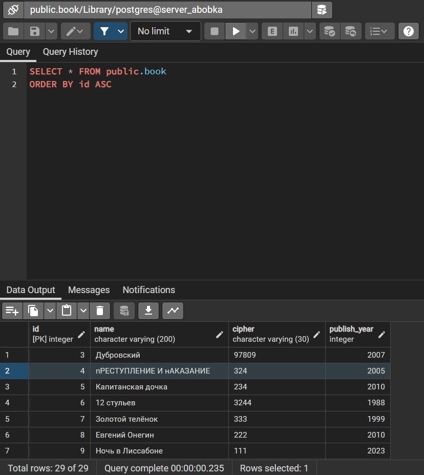

# ВЫПОЛНЕНИЕ ДЗ ПО БД
*  4. <font color = "ffff00">Создать представление(LibrarianBooks) для пользователя БиблиотекарьРедактирующи (LibrarianEdiror) которое покажет все книги.  В будущем дять грант этому ползователю изменять это представление.</font>

Был создан сервер либрериан серврер, также создано представление:
```SQL
CREATE VIEW Librarian_Books
SELECT *
FROM BOOK
```

Затем дадим грантов ролям
```sql
GRANT SELECT, INSERT, UPDATE, DELETE ON Librarian_Books TO LIBRARIAN_EDITOR_ROLE
```
ВСЕ РАБОТАЕТ ОТ ИМЕНИ ИВАНОВА

ПОПРОБУЕМ ПОМЕНЯТЬ КНИГУ
```SQL
UPDATE LIBRARIAN_BOOKS
SET NAME = 'пРЕСТУПЛЕНИЕ И нАКАЗАНИЕ'
WHERE ID = 4;
```


И ЧЕРЕЗ ТАБЛИЦУ ТОЖЕ ПОМЕНЯЛОСЬ



* 5. <font color = "ffff00">Создать представление(LibrarianBooksGivenLastWeek) которое позволяет просматривать выдачу книг, которые брали только за последнюю неделю.</font>

```SQL
CREATE VIEW LIBRARIAN_BOOKS_GIVEN_LAST_WEEK
AS SELECT B.NAME, TRB.DATE_TAKE, TRB.DATE_RETURN
FROM BOOK B, TAKE_RETURN_BOOK TRB
WHERE TRB.DATE_TAKE >= CURRENT_DATE - INTERVAL '1 week' AND TRB.DATE_TAKE < CURRENT_DATE AND B.ID = TRB.BOOK_ID;
```
```SQL
--УЛУЧШЕННАЯ ТАБЛИЦА
CREATE OR REPLACE VIEW public.librarian_books_given_last_week
 AS
 SELECT
    trb.date_take,
    trb.date_return,
	TRB.BOOK_ID,
	TRB.LIBRARIAN_ID,
	TRB.READER_ID,
    l.login
   FROM
    take_return_book trb,
    librarian l
  WHERE trb.date_take >= (CURRENT_DATE - '7 days'::interval) AND trb.date_take < CURRENT_DATE AND trb.librarian_id = l.id;

ALTER TABLE public.librarian_books_given_last_week
    OWNER TO postgres;
```


* 6. <font color = "ffff00">Создать представления для пользователя БиблиотекарьВыдающийКниги(LibrarianBooksGiver): Первое - LibrarianBooksLook - позволяет 
только просматривать книги(Дать грант только на чтение этого представления),второе LibrarianBooksGiven  основанное на 
представлении LibrarianBooksGivenLastWeek и показывающее только выдачи, сделанные только этим библиотекарем. 
Дать грант на чтение и записть в данное представление.
Проконтролировать, что библиотекарь не может сделать запись о выдаче во второе представление ранее чем неделю назад. Так как  LibrarianBooksGiven основано на LibrarianBooksGivenLastWeek, то это возможно.
Для этого установить with cascaded check option для второго представления. Проверить каскадный with cascaded check option: попробовать от имени этого пользователя добавить запись раньше чем неделю назад, убедиться, что это не возможно.</font>

```sql
GRANT SELECT ON Librarian_Books TO LIBRARIAN_book_giver_role
```
```sql
CREATE VIEW Librarian_Books_Given AS
SELECT *
FROM LIBRARIAN_BOOKS_GIVEN_LAST_WEEK
WHERE LOGIN = CURRENT_USER
```
```SQL
CREATE OR REPLACE VIEW public.librarian_books_given
 AS
 SELECT lw.date_take,
    lw.date_return,
    lw.book_id,
    lw.librarian_id,
    lw.reader_id
   FROM librarian_books_given_last_week lw
with cascaded check option;
ALTER TABLE public.librarian_books_given
    OWNER TO postgres;

GRANT ALL ON TABLE public.librarian_books_given TO librarian_book_giver_role;
GRANT ALL ON TABLE public.librarian_books_given TO postgres;
```
```SQL
GRANT ALL PRIVILEGES ON Librarian_Books_GIVEN TO LIBRARIAN_book_giver_role
```
```SQL
GRANT ALL  ON take_return_book_id_seq TO LIBRARIAN_book_giver_role
```

* 7. <font color = "ffff00">Изменить представление из предыдущего пункта (можно удалить и заново создать) что-бы у него было with local check option. Попробовать от имени этого пользователя LibrarianBooksGiven добавить запись раньше чем неделю назад, убедиться, что теперь это возможно так как каскадное условие из базового представления не распространяется на данное представление.</font>
### УЖЕ СДЕЛАНО ВЫШЕ В 6 ПУНКТЕ

* 8. <font color = "ffff00"> Создать представление которое покажет по авторам сколько книг было взято за последний месяц. AuthorsBookLastMonthGiven. 
	Попробовать создать запрос на основе этого представления, который покажет количество авторов которых вообще брали за последний месяц,
		попробовав сделать count по уже посчитанному count в представлении(это может не получиться из-за ограничения представлений).
	Попробовать создать запрос на основе этого представления, который покажет количество книг взятых за последний месяц. sum  по cnt (это может не получиться из-за ограничения представлений) </font>

```sql
CREATE VIEW Authors_Book_Last_Month_Give AS 
SELECT A.SURNAME, COUNT(A.SURNAME) AS COUNT_AUTHOR
FROM TAKE_RETURN_BOOK TRB, AUTHOR_BOOK AB, AUTHOR A
WHERE TRB.DATE_TAKE >= CURRENT_DATE - INTERVAL '1 month' AND TRB.DATE_TAKE < CURRENT_DATE
AND TRB.BOOK_ID = AB.BOOK_ID
AND AB.AUTHOR_ID = A.ID
GROUP BY A.SURNAME
```


* 9. <font color = "ffff00">Создать домен серия паспорта PASSP_SERIYA который будет проверять, что введено целое число состоящее ровно из 4 цифр, и номер паспорта (PASSP_NUM) целое число, состоящее ровно из 6 цифр, установить значения по умолчанию для серии: 1000 и для номера: 100000 в доменах соответственно.
Добавить поля в таблицу Читатель: серия и номер пасспорта основанные на соответствующих доменах.
Попробовать добавить запись с ошибочным количеством цифр в серии паспорта, должна появиться ошибка. Исправить ошибку и добавить запись.
Попробовать добавить запись с ошибочным количеством цифр в номере пасспорта, должна появиться ошибка. Исправить ошибку и добавить запись.</font>

ДЛЯ СЕРИИ ПАСПОРТА
```SQL
CREATE DOMAIN PASP_SERIYA_TYPE AS INTEGER
	DEFAULT 1000
	CHECK (VALUE >= 1000 AND VALUE <= 9999)
```
ДЛЯ НОМЕРА ПАСПОРТА
```SQL
CREATE DOMAIN PASP_NUM_TYPE AS INTEGER
	DEFAULT 100000
	CHECK (VALUE >= 100000 AND VALUE <= 999999)
```


ДОБАВЛЯЕМ НОВЫЕ СТОЛБЦЫ ДЛЯ ЧИТАТЕЛЕЙ:
```SQL
ALTER TABLE READER ADD PASP_SERIYA PASP_SERIYA_TYPE
```
```SQL
ALTER TABLE READER ADD PASP_NUM PASP_NUM_TYPE
```
РЕЗУЛЬТАТ ПОСЛЕ ДОБАВЛЯЕНИЯ НОВЫХ СТОЛБЦОВ:

ПРОБУЕМ ДЕЛАТЬ С ОШИБКОЙ, К ПРИМЕРУ ОБНОВНИМ КОГО-ТО ИЗ ЧИТАТЕЛЕЙ СЕРИЮ ПАСПОРТА НА 999
```SQL
UPDATE READER
SET PASP_SERIYA = 999
WHERE ID = 3
```
ВЫДАЛ С ОШИБКОЙ, РАБОТАЕТ CHECK


* <font color = "ffff00">10. Добавить читателю поле рост height целого типа со значением по умолчанию ноль.</font>
```SQL
ALTER TABLE READER ADD COLUMN HEIGHT INTEGER DEFAULT 0
```

* 11. <font color = "ffff00">Добавить таблицу Оценка работы библиотеки. MarkLib. Которая будет состоять из столбцов: id, reader_id, mark, date. Читатель может выставлять оценку раз в месяц(это мы сделаем позже). Пока foreign key не задаем.</font>
```SQL
CREATE TABLE MARKLIB (
	ID SERIAL PRIMARY KEY,
	READER_ID INTEGER NOT NULL,
	MARK INTEGER,
	DATE_MARK DATE,
	CHECK(MARK >= 0 AND MARK <= 10 OR MARK = NULL)
)
```
* 12. <font color = "ffff00">Добавить в виде отдельного constraint(отдельный оператор) огранчение целостности foreign key на таблицу MarkLiv так, что-бы несуществующий читатель добавить оценку не мог, но при удалении читателя запись об оценке не удалялась,
а значение внешнего ключа просто заполнялось бы нулем. Но при изменении id читателя соответсвенно менялся бы и id в данной таблице. </font>

```SQL
ALTER TABLE MARKLIB ADD CONSTRAINT MARKLIB_READER_ID_FKEY
FOREIGN KEY (READER_ID)
REFERENCES READER(ID);
```

* 13. <font color = "ffff00">Добавить отдельно ограничение целостности constraint на таблицу MarkLib типа check так, что-бы вводимая дата date была позже чем 01.01.2024.</font>
```SQL
ALTER TABLE MARKLIB ADD CHECK (DATE_MARK > '01-01-2024')
```

