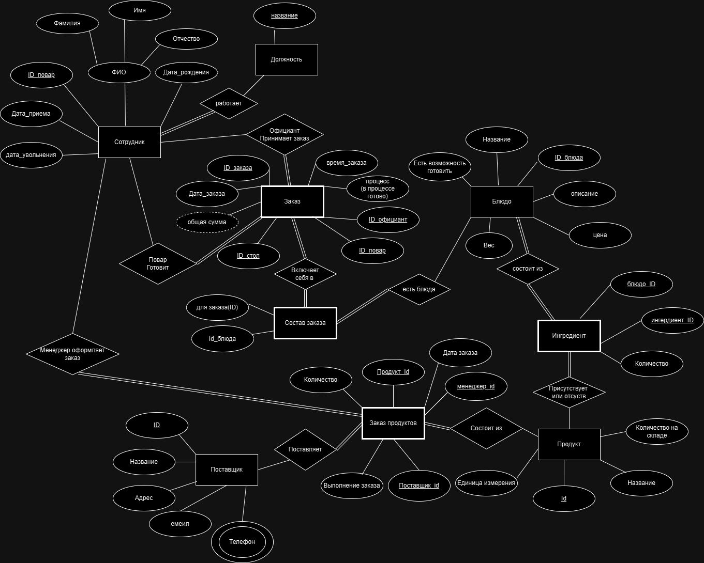
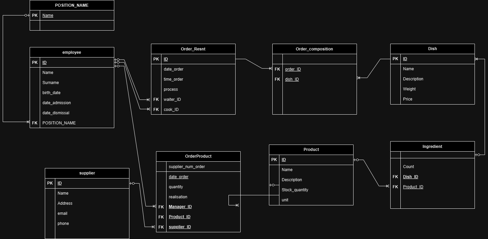

# Итоговая работа по базам данным на PostgreSQL

## Тема: Ресторан

# Диаграмма Чена



# Диаграмма Мартина



# Даталогическая модель

## **POSITION_NAME**
|№|Наименование|Идентификатор|Тип|Длина|Ограничение|
|-|------------|-------------|---|-----|-----------|
|1|Название|Name|Varchar(100)|100|Nn(Not null), PK(Primary Key)|

## **Employee**
|№|Наименование|Идентификатор|Тип|Длина|Ограничение|
|-|------------|-------------|---|-----|-----------|
|1|Id|Id|Serial|4|Nn(Not null), PK(Primary Key)|
|2|Имя|Name|Varchar(100)|100|Nn|
|3|Фамилия|Surname|Varchar(100)|100|Nn|
|4|Дата рождения|birth_date|Date|4|Nn|
|5|Дата принятия|date_admission|Date|4|Nn|
|6|Дата увольнения|date_dismissal|Date|4||
|7|Должность|POSITION_NAME|Varchar(100)|100|FK, Nn|

## **Order**
|№|Наименование|Идентификатор|Тип|Длина|Ограничение|
|-|------------|-------------|---|-----|-----------|
|1|Id|Id|Serial|4|Nn(Not null), PK(Primary Key)|
|2|Дата заказа|date_order|Date|4|Nn|
|3|Время заказа|time_order|Date|4|Nn|
|4|Процесс|process|Domain|4|Nn|
|5|waiter_ID|waiter_ID|Int|4|FK, Nn|
|6|cook_ID|cook_ID|Date|Int|FK|

## **Order_composition**
|№|Наименование|Идентификатор|Тип|Длина|Ограничение|
|-|------------|-------------|---|-----|-----------|
|1|order_ID|order_ID|Int|4|FK, Nn|
|2|dish_ID|dish_ID|Int|4|FK, Nn|

## **Dish**
|№|Наименование|Идентификатор|Тип|Длина|Ограничение|
|-|------------|-------------|---|-----|-----------|
|1|Id|Id|Serial|4|Nn(Not null), PK(Primary Key)|
|2|Имя|Name|Varchar(100)|100|Nn|
|3|Описание|Description|Varchar(1500)|1500||
|4|Вес|Weight|Int|4|> 0|
|5|Цена|Price|money|8|> 0|

## **Ingredient**
|№|Наименование|Идентификатор|Тип|Длина|Ограничение|
|-|------------|-------------|---|-----|-----------|
|1|Количество|Count|Int|4||
|2|Dish_ID|Dish_ID|Int|4|FK, Nn|
|3|Product_ID|Product_ID|Int|4|FK, Nn|

## **Product**
|№|Наименование|Идентификатор|Тип|Длина|Ограничение|
|-|------------|-------------|---|-----|-----------|
|1|Id|Id|Serial|4|Nn(Not null), PK(Primary Key)|
|2|Имя|Name|Varchar(100)|100|Nn|
|3|Описание|Description|Varchar(1500)|1500||
|4|Количество на складе|Stock_quantity|Int|4|> 0|
|5|Единица измерения|unit|Domain||Nn|

## **OrderProduct**
|№|Наименование|Идентификатор|Тип|Длина|Ограничение|
|-|------------|-------------|---|-----|-----------|
|1|supplier_num_order|supplier_num_order|Int|4||
|2|Дата заказа|date_order|Date|4|Nn|
|3|quantity|Количество|Int|4|Nn|
|4|Реализация|realisation|Domain||Nn|
|5|Manager_ID|Manager_ID|Int|4|FK, Nn|
|6|Product_ID|Product_ID|Int|4|FK, Nn|
|7|supplier_ID|supplier_ID|Date|Int|FK, Nn|

## **supplier**
|№|Наименование|Идентификатор|Тип|Длина|Ограничение|
|-|------------|-------------|---|-----|-----------|
|1|Id|Id|Serial|4|Nn(Not null), PK(Primary Key)|
|2|Имя|Name|Varchar(100)|100|Nn|
|3|Адрес|Address|Varchar(100)|100|Nn|
|4|Эл. почта|email|Varchar(100)|100||
|5|Телефон|phone|Varchar(20) |20|Nn|

# Создание таблицы через SQL
```sql
CREATE TABLE POSITION_NAME (
	NAME VARCHAR(100) PRIMARY KEY NOT NULL
);

CREATE TABLE employee (
	ID SERIAL PRIMARY KEY,
	NAME VARCHAR(100),
	SURNAME VARCHAR(100) NOT NULL,
	BIRTH_DATE DATE NOT NULL,
	DATE_ADMISSION  DATE NOT NULL,
	DATE_DISMISSAL DATE,
	POSITION_NAME VARCHAR(100) NOT NULL,
	FOREIGN KEY (POSITION_NAME) REFERENCES POSITION_NAME (NAME) ON UPDATE CASCADE
);
CREATE INDEX SURNAME_NAME_IDX ON employee(NAME, SURNAME);


CREATE DOMAIN PROCESS_TYPE VARCHAR(9) CHECK(VALUE IN ('СОЗДАН', 'ГОТОВИТСЯ', 'ГОТОВО'));

CREATE TABLE ORDER_RESNT (
	ID SERIAL PRIMARY KEY,
	DATE_ORDER DATE NOT NULL,
	TIME_ORDER TIME NOT NULL,
	PROCESS PROCESS_TYPE NOT NULL,
	SUM_ORDER MONEY,
	employee_WAITER_ID INT NOT NULL,
	employee_COOK_ID INT, 
	CONSTRAINT CHK_SUM_ORDER CHECK (SUM_ORDER::numeric > 0.0000),
	FOREIGN KEY (employee_WAITER_ID) REFERENCES employee (ID) ON UPDATE CASCADE,
	FOREIGN KEY (employee_COOK_ID) REFERENCES employee (ID) ON UPDATE CASCADE
);

CREATE INDEX DATE_ORDER_IDX ON ORDER_RESNT(DATE_ORDER);

CREATE TABLE DISH (
	ID SERIAL PRIMARY KEY,
	NAME VARCHAR(100) NOT NULL,
	DESCRIPTION VARCHAR(1500),
	WEIGHT REAL NOT NULL,
	PRICE MONEY NOT NULL,
	CONSTRAINT CHK_PRICE CHECK (PRICE::numeric > 0.0000)
);

CREATE TABLE ORDER_COMPOSITION (
	ORDER_RESNT_ID INT NOT NULL,
	DISH_ID INT NOT NULL, 
	FOREIGN KEY (ORDER_RESNT_ID) REFERENCES ORDER_RESNT (ID) ON DELETE CASCADE ON UPDATE CASCADE,
	FOREIGN KEY (DISH_ID) REFERENCES DISH (ID) ON DELETE CASCADE ON UPDATE CASCADE
);

CREATE DOMAIN UNIT_TYPE VARCHAR(9) CHECK(VALUE IN ('МИЛЛИЛИТР' ,'ЛИТР', 'ГРАММ', 'КИЛОГРАММ', 'ТОНН'));

CREATE TABLE PRODUCT (
	ID SERIAL PRIMARY KEY,
	NAME VARCHAR(100) NOT NULL,
	DESCRIPTION VARCHAR(1500),
	Stock_quantity INT,
	UNIT UNIT_TYPE,
	CONSTRAINT CHK_Stock_quantity CHECK (Stock_quantity >= 0)
);

CREATE TABLE INGREDIENT (
	quantity INT NOT NULL,
	DISH_ID INT NOT NULL,
	PRODUCT_ID INT NOT NULL,
	FOREIGN KEY (DISH_ID) REFERENCES DISH (ID) ON DELETE CASCADE ON UPDATE CASCADE,
	FOREIGN KEY (PRODUCT_ID) REFERENCES PRODUCT (ID) ON DELETE CASCADE ON UPDATE CASCADE
);

CREATE TABLE SUPPLIER (
	ID SERIAL PRIMARY KEY,
	NAME VARCHAR(100) NOT NULL,
	Address VARCHAR(100) NOT NULL,
	EMAIL VARCHAR(100),
	PHONE VARCHAR(10) NOT NULL
);

CREATE DOMAIN realisation_TYPE VARCHAR(20) CHECK (VALUE IN ('СОЗДАН', 'В СБОРКЕ', 'В ДОСТАВКЕ', 'ДОСТАВЛЕН'));

CREATE TABLE ORDER_PRODUCT (
	DATE_ORDER DATE NOT NULL,
	quantity INT NOT NULL,
	realisation realisation_TYPE,
	manager_id int not null,
	PRODUCT_ID INT NOT NULL,
	supplier_ID INT NOT NULL,
	PRIMARY KEY (DATE_ORDER, MANAGER_ID, PRODUCT_ID, SUPPLIER_ID),
	FOREIGN KEY (manager_id) REFERENCES employee (ID) ON UPDATE CASCADE,
	FOREIGN KEY (PRODUCT_ID) REFERENCES PRODUCT (ID) ON UPDATE CASCADE,
	FOREIGN KEY (supplier_ID) REFERENCES supplier (ID) ON UPDATE CASCADE
);
```

# Бизнес логика(Триггеры)

1. Создание заказа должен делать официант, а повар реализует заказ
2. При приготовлении блюда, количество продуктов должна уменьшаться
3. При выполнении заказа на продукты, количество соотвествующих продуктов увеличится
4. Заказ продуктов должен делать менеджер с помощью проверки по ID должности
5. При создании заказа проверить наличие ингредиентов для всех блюд
6. Реализовать логгирование для таблицы Order_Resnt(для этого создать таблицу логов Order_resnt_log(Дата время, операция, имя пользователя, список старых данных полей, список новых данных полей))

# Создать логгирования для таблицу логов

1. Создание заказа должен делать официант, а повар реализует заказ
```SQL
CREATE OR REPLACE FUNCTION F_TRIGGER_ORDER_RESNT_ON_INSERT() RETURNS TRIGGER AS
$$
DECLARE
	POS_NAME VARCHAR(100);
BEGIN
	SELECT POSITION_NAME
	FROM EMPLOYEE E
	WHERE E.ID = NEW.EMPLOYEE_WAITER_ID
	INTO POS_NAME;
	IF UPPER(POS_NAME) <> 'ОФИЦИАНТ'
	THEN
		RAISE EXCEPTION 'ДОБАВЛЯТЬ ЗАКАЗА ДОЛЖЕН ОФИЦИАНТ';
		RETURN NULL;
	END IF;
	RETURN NEW;
END;
$$
LANGUAGE 'plpgsql';

CREATE TRIGGER TRIG_INSERT_ORDER_RESNT BEFORE INSERT ON ORDER_RESNT FOR EACH ROW EXECUTE FUNCTION F_TRIGGER_ORDER_RESNT_ON_INSERT();
```
```SQL
CREATE OR REPLACE FUNCTION F_TRIGGER_ORDER_RESNT_ON_UPDATE() RETURNS TRIGGER AS
$$
DECLARE
	POS_NAME VARCHAR(100);
BEGIN
	SELECT POSITION_NAME
	FROM EMPLOYEE E
	WHERE E.ID = NEW.EMPLOYEE_WAITER_ID
	INTO POS_NAME;
	IF UPPER(POS_NAME) <> 'ОФИЦИАНТ'
	THEN
		RAISE EXCEPTION 'ДОБАВЛЯТЬ ЗАКАЗ ИЛИ МЕНЯТЬ ДОЛЖЕН ОФИЦИАНТ';
		RETURN NULL;
	END IF;
	SELECT POSITION_NAME
	FROM EMPLOYEE E
	WHERE E.ID = NEW.EMPLOYEE_COOK_ID
	INTO POS_NAME;
	IF UPPER(POS_NAME) <> 'ПОВАР'
	THEN
		RAISE EXCEPTION 'ГОТОВИТЬ ЗАКАЗ ДОЛЖЕН ТОЛЬКО ПОВАР';
		RETURN NULL;
	END IF;
	RETURN NEW;
END;
$$
LANGUAGE 'plpgsql';

CREATE TRIGGER TRIG_UPDATE_ORDER_RESNT BEFORE UPDATE ON ORDER_RESNT FOR EACH ROW EXECUTE FUNCTION F_TRIGGER_ORDER_RESNT_ON_UPDATE();
```
2. При приготовлении блюда, количество продуктов должна уменьшаться
```SQL
CREATE or replace FUNCTION TRIG_INSERT_ORDER_COMPOSITION_FUN() RETURNS TRIGGER AS
$$
DECLARE
	required_quantity INT;
    prod_id INT;
	available_quantity INT;
BEGIN
	FOR required_quantity, prod_id, available_quantity IN
        SELECT i.quantity, p.id, p.Stock_quantity 
        FROM INGREDIENT i 
        JOIN PRODUCT p ON i.PRODUCT_ID = p.ID 
        WHERE i.DISH_ID = NEW.DISH_ID
    LOOP
        -- Check if there is enough stock
        IF available_quantity < required_quantity THEN
            RAISE EXCEPTION 'НЕДОСТАТОЧНО ПРОДУКТОВ НА СКЛАДЕ %', prod_id;
        END IF;

        -- Update the product stock
        UPDATE PRODUCT
        SET Stock_quantity = Stock_quantity - required_quantity 
        WHERE ID = prod_id;
    END LOOP;

    RETURN NEW;
END;
$$ LANGUAGE 'plpgsql';

CREATE TRIGGER TRIG_INSERT_ORDER_COMPOSITION BEFORE INSERT ON ORDER_COMPOSITION FOR EACH ROW EXECUTE FUNCTION TRIG_INSERT_ORDER_COMPOSITION_FUN();
```
3. При выполнении заказа на продукты, количество соотвествующих продуктов увеличится
```sql
CREATE OR REPLACE FUNCTION increase_product_quantity() RETURNS TRIGGER AS 
$$
BEGIN
	IF (UPPER(OLD.REALISATION) <> 'ДОСТАВЛЕН' AND UPPER(NEW.REALISATION) = 'ДОСТАВЛЕН') THEN
		UPDATE PRODUCT
		SET Stock_quantity = Stock_quantity + NEW.quantity
		WHERE ID = NEW.PRODUCT_ID;
	END IF;
	
	IF (UPPER(OLD.REALISATION) = 'ДОСТАВЛЕН') THEN
		RAISE EXCEPTION 'ПОСЛЕ ДОСТАВКИ НЕЛЬЗЯ МЕНЯТЬ ЗАПИСЬ';
		RETURN NULL;
	END IF;

	IF upper((SELECT POSITION_NAME FROM employee WHERE ID = NEW.manager_id)) != 'МЕНЕДЖЕР' THEN
        RAISE EXCEPTION 'Размещать заказы на продукцию имеют право только менеджеры.';
		RETURN NULL;
    END IF;
	

    RETURN NEW;
END;
$$ LANGUAGE plpgsql;

CREATE TRIGGER increase_product_quantity_trigger AFTER UPDATE ON ORDER_PRODUCT FOR EACH ROW EXECUTE FUNCTION increase_product_quantity();
```
4. Заказ продуктов должен делать менеджер с помощью проверки по ID должности
```sql
CREATE OR REPLACE FUNCTION check_insert_manager_and_increase_quantity() RETURNS TRIGGER AS 
$$
BEGIN
    IF upper((SELECT POSITION_NAME FROM employee WHERE ID = NEW.manager_id)) != 'МЕНЕДЖЕР' THEN
        RAISE EXCEPTION 'Размещать заказы на продукцию имеют право только менеджеры.';
		RETURN NULL;
    END IF;

    RETURN NEW;
END;
$$ LANGUAGE plpgsql;

CREATE TRIGGER check_insert_manager_and_increase_quantity_trigger AFTER INSERT ON ORDER_PRODUCT FOR EACH ROW EXECUTE FUNCTION check_insert_manager_and_increase_quantity();
```
5. При создании заказа проверить наличие ингредиентов для всех блюд
```sql
CREATE OR REPLACE FUNCTION check_ingredients_availability() RETURNS TRIGGER AS 
$$
DECLARE
    required_quantity INT;
    available_quantity INT;
	prod_name varchar(100);
BEGIN
    FOR prod_name, required_quantity, available_quantity IN
        SELECT p.name, i.quantity, p.Stock_quantity
        FROM INGREDIENT i
        JOIN PRODUCT p ON i.PRODUCT_ID = p.ID
        WHERE i.DISH_ID = NEW.DISH_ID
    LOOP
        IF available_quantity < required_quantity THEN
            RAISE EXCEPTION 'Недостаточно запасов для идентификатора продукта %', prod_name;
        END IF;
    END LOOP;

    RETURN NEW;
END;
$$ LANGUAGE plpgsql;

CREATE TRIGGER check_ingredients_availability_trigger BEFORE INSERT ON ORDER_COMPOSITION FOR EACH ROW EXECUTE FUNCTION check_ingredients_availability();
```
6. 
```sql
CREATE DOMAIN OPERATION_TYPE VARCHAR(6) CHECK(VALUE IN ('INSERT', 'UPDATE', 'DELETE'));
CREATE TABLE Order_resnt_log (
	date_time timestamp primary key not null,
	user_name character varying(30),
	operation OPERATION_TYPE,
	old_fields character varying(1000),
	new_fields character varying(1000)
)
```
## 6.B Придумать и написать хранимую процедуру, которая выдаёт данные в виде одной строки(как запрос, но одна строка).
```SQL
-- создание функции которая возвращает запись
CREATE OR REPLACE FUNCTION GET_SUPPLIER_INFO(NAME_ VARCHAR(100)) RETURNS RECORD AS
$$
DECLARE
	SUPLLIER_REC RECORD;
BEGIN
	SELECT ID, NAME, ADDRESS, EMAIL, PHONE
	INTO SUPLLIER_REC
	FROM SUPPLIER
	WHERE UPPER(NAME) = UPPER(NAME_);
	
	RETURN SUPLLIER_REC;
END;
$$ LANGUAGE plpgsql;
```
```SQL
-- вызов функции
SELECT ID, NAME, ADDRESS, EMAIL, PHONE
FROM GET_SUPPLIER_INFO('СУЕТОЛОГ') AS SUPPLIER_rec(ID INT, NAME VARCHAR(100), ADDRESS VARCHAR(100), EMAIL VARCHAR(100), PHONE VARCHAR(10));
```
6B 
```SQL
CREATE OR REPLACE FUNCTION GET_PRODUCT_ORDER_INFO_FOR_DATE(DATE_ DATE) RETURNS TABLE(supplier_num_order_ INT, date_order_	Date, quantity_	Int, realisation_ realisation_TYPE, Manager_ID_ Int, Product_ID_ Int, supplier_ID_ INT) AS
$$
DECLARE
BEGIN
	RETURN QUERY
	SELECT supplier_num_order, date_order, quantity, realisation, Manager_ID, Product_ID, supplier_ID
	FROM ORDER_PRODUCT
	WHERE DATE_ = date_order;
END;
$$ LANGUAGE plpgsql;
```
```SQL
SELECT * FROM GET_PRODUCT_ORDER_INFO_FOR_DATE('18-06-2024');
```


```sql
CREATE OR REPLACE FUNCTION LOG_ORDER_RESNT_INSERT() RETURNS TRIGGER AS 
$$
BEGIN
    INSERT INTO ORDER_RESNT_LOG (DATE_TIME, USER_NAME, operation, new_fields)
    VALUES (NOW(), current_user, 'INSERT', 'date_order:'|| NEW.date_order || '; ' || 'time_order:' || NEW.time_order ||'; ' || 'process: ' || NEW.process || '; ' || 'employee_waiter_id: ' || new.employee_waiter_id || '; ' || 'employee_cook_id: ' || NEW.employee_waiter_id || '; ');
    RETURN NEW;
END;
$$ LANGUAGE plpgsql;

CREATE TRIGGER TRIG_ORDER_RESNT_INSERT_TRIGGER AFTER INSERT ON ORDER_RESNT FOR EACH ROW EXECUTE FUNCTION LOG_ORDER_RESNT_INSERT();
```
```sql
CREATE OR REPLACE FUNCTION LOG_ORDER_RESNT_delete()
RETURNS TRIGGER AS $$
BEGIN
    INSERT INTO ORDER_RESNT_LOG (DATE_TIME, USER_NAME, operation, old_fields)
    VALUES (NOW(), current_user, 'DELETE', 'date_order:'|| OLD.date_order || '; ' || 'time_order:' || OLD.time_order ||'; ' || 'process: ' || OLD.process || '; ' || 'employee_waiter_id: ' || OLD.employee_waiter_id || '; ' || 'employee_cook_id: ' || OLD.employee_waiter_id || '; ');
    RETURN OLD;
END;
$$ LANGUAGE plpgsql;

CREATE TRIGGER trig_log_ORDER_RESNT_delete AFTER DELETE ON order_resnt FOR EACH ROW EXECUTE FUNCTION LOG_ORDER_RESNT_delete();
```

```sql

CREATE OR REPLACE FUNCTION LOG_ORDER_RESNT_update()
RETURNS TRIGGER AS $$
DECLARE
	RESULT_STR VARCHAR(300);
BEGIN
	RESULT_STR = '';
	IF OLD.DATE_ORDER <> NEW.DATE_ORDER
	THEN
		RESULT_STR = RESULT_STR  || 'DATE_ORDER: ' || OLD.DATE_ORDER || ' -> ' || NEW.DATE_ORDER || ' ';
	END IF;
	IF OLD.TIME_ORDER <> NEW.TIME_ORDER
	THEN
		RESULT_STR = RESULT_STR  || 'TIME_ORDER: ' || OLD.TIME_ORDER || ' -> ' || NEW.TIME_ORDER || ' ';
	END IF;
	IF OLD.process <> NEW.process
	THEN
		RESULT_STR = RESULT_STR  || 'PROCESS: ' || OLD.PROCESS || ' -> ' || NEW.PROCESS || ' ';
	END IF;
	IF OLD.employee_waiter_id <> NEW.employee_waiter_id
	THEN
		RESULT_STR = RESULT_STR  || 'employee_waiter_id: ' || OLD.employee_waiter_id || ' -> ' || NEW.employee_waiter_id || ' ';
	END IF;
	IF OLD.employee_cook_id <> NEW.employee_cook_id
	THEN
		RESULT_STR = RESULT_STR  || 'employee_cook_id: ' || OLD.employee_cook_id || ' -> ' || NEW.employee_cook_id || ' ';
	END IF;
    INSERT INTO ORDER_RESNT_log (DATE_TIME, USER_NAME, operation, old_fields, new_fields)
    VALUES (NOW(), current_user, 'UPDATE', 'date_order:'|| OLD.date_order || '; ' || 'time_order:' || OLD.time_order ||'; ' || 'process: ' || OLD.process || '; ' || 'employee_waiter_id: ' || OLD.employee_waiter_id || '; ' || 'employee_cook_id: ' || OLD.employee_waiter_id || '; ''date_order:'|| OLD.date_order || '; ' || 'time_order:' || OLD.time_order ||'; ' || 'process: ' || OLD.process || '; ' || 'employee_waiter_id: ' || OLD.employee_waiter_id || '; ' || 'employee_cook_id: ' || OLD.employee_waiter_id || '; ', RESULT_STR);
    RETURN NEW;
END;
$$ LANGUAGE plpgsql;

CREATE TRIGGER trig_log_order_resnt_update
AFTER UPDATE ON order_resnt
FOR EACH ROW
EXECUTE FUNCTION LOG_ORDER_RESNT_update();
```
### КАК ВАРИАНТ
```SQL
CREATE OR REPLACE FUNCTION LOG_ORDER_RESNT_update()
RETURNS TRIGGER AS $$
DECLARE
BEGIN
    INSERT INTO ORDER_RESNT_log (DATE_TIME, USER_NAME, operation, old_fields, new_fields)
    VALUES (NOW(), current_user, 'UPDATE', 'date_order:'|| OLD.date_order || '; ' || 'time_order:' || OLD.time_order ||'; ' || 'process: ' || OLD.process || '; ' || 'employee_waiter_id: ' || OLD.employee_waiter_id || '; ' || 'employee_cook_id: ' || OLD.employee_waiter_id || '; ''date_order:'|| OLD.date_order || '; ' || 'time_order:' || OLD.time_order ||'; ' || 'process: ' || OLD.process || '; ' || 'employee_waiter_id: ' || OLD.employee_waiter_id || '; ' || 'employee_cook_id: ' || OLD.employee_waiter_id || '; ',
			'date_order:'|| NEW.date_order || '; ' || 'time_order:' || NEW.time_order ||'; ' || 'process: ' || NEW.process || '; ' || 'employee_waiter_id: ' || new.employee_waiter_id || '; ' || 'employee_cook_id: ' || NEW.employee_waiter_id || '; ''date_order:'|| NEW.date_order || '; ' || 'time_order:' || NEW.time_order ||'; ' || 'process: ' || NEW.process || '; ' || 'employee_waiter_id: ' || new.employee_waiter_id || '; ' || 'employee_cook_id: ' || NEW.employee_waiter_id || '; ');
    RETURN NEW;
END;
$$ LANGUAGE plpgsql;
```
## Обслуживание БД включающая архивирование накопительных таблиц у удаление старых логов, удаление старых архивных данных
```sql
-- таблицы для архивирования
CREATE TABLE ORDER_RESNT_archive (
	ID INT PRIMARY KEY,
	DATE_ORDER DATE,
	TIME_ORDER TIME,
	PROCESS PROCESS_TYPE,
	SUM_ORDER MONEY,
	employee_WAITER_ID INT,
	employee_COOK_ID INT
);

CREATE TABLE ORDER_PRODUCT_ARCHIVE (
	DATE_ORDER DATE,
	quantity INT,
	realisation realisation_TYPE,
	manager_id int,
	PRODUCT_ID INT,
	supplier_ID INT
);
```

```SQL
CREATE OR REPLACE PROCEDURE ARCHIVE_DATA_PROC(DATE) AS 
$$
DECLARE
	ARCHIVE_DATE ALIAS FOR $1;
	DATE_THREE_MONTH_AGO_RESNT ORDER_RESNT.DATE_ORDER%TYPE;
	ROW_RESNT ORDER_RESNT%ROWTYPE;
	
	DATE_THREE_MONTH_AGO_PROD ORDER_PRODUCT.DATE_ORDER%TYPE;
	ROW_PROD ORDER_PRODUCT%ROWTYPE;
BEGIN
	DATE_THREE_MONTH_AGO_RESNT =  date_trunc('month', ARCHIVE_DATE) - interval '3 month';
	FOR ROW_RESNT IN SELECT *
	FROM ORDER_RESNT ORDR
	WHERE ORDR.DATE_ORDER >= DATE_THREE_MONTH_AGO_RESNT 
	LOOP
		IF NOT EXISTS(SELECT *
					  FROM ORDER_RESNT_ARCHIVE 
					  WHERE ID = ROW_RESNT.ID)
		THEN
			INSERT INTO ORDER_RESNT_ARCHIVE(id, DATE_ORDER, TIME_ORDER, PROCESS, SUM_ORDER, employee_WAITER_ID, employee_COOK_ID)
			VALUES(ROW_RESNT.id, ROW_RESNT.DATE_ORDER, ROW_RESNT.TIME_ORDER, ROW_RESNT.PROCESS, ROW_RESNT.SUM_ORDER, ROW_RESNT.employee_WAITER_ID, ROW_RESNT.employee_COOK_ID);
			DELETE FROM order_resnt
			WHERE ID = ROW_RESNT.ID;
		END IF;
	END LOOP;
	----------------------------------------------------------------------------------------------------------
	DATE_THREE_MONTH_AGO_PROD =  date_trunc('month', ARCHIVE_DATE) - interval '3 month';
	FOR ROW_PROD IN SELECT *
	FROM ORDER_PRODUCT OP
	WHERE OP.DATE_ORDER >= DATE_THREE_MONTH_AGO_PROD 
	LOOP
		IF NOT EXISTS(SELECT *
					  FROM ORDER_PRODUCT_ARCHIVE 
					  WHERE DATE_ORDER = ROW_PROD.DATE_ORDER AND PRODUCT_ID = ROW_PROD.PRODUCT_ID AND MANAGER_ID = ROW_PROD.MANAGER_ID AND SUPPLIER_ID = ROW_PROD.SUPPLIER_ID)
		THEN
			INSERT INTO ORDER_PRODUCT_ARCHIVE(DATE_ORDER, quantity, realisation, manager_id, PRODUCT_ID, supplier_ID)
			VALUES(ROW_PROD.DATE_ORDER, ROW_PROD.quantity, ROW_PROD.realisation, ROW_PROD.manager_id, ROW_PROD.PRODUCT_ID, ROW_PROD.supplier_ID);
			DELETE FROM ORDER_PRODUCT
			WHERE DATE_ORDER = ROW_PROD.DATE_ORDER AND PRODUCT_ID = ROW_PROD.PRODUCT_ID AND MANAGER_ID = ROW_PROD.MANAGER_ID AND SUPPLIER_ID = ROW_PROD.SUPPLIER_ID;
		END IF;
	END LOOP;
END;
$$
LANGUAGE 'plpgsql';
```
