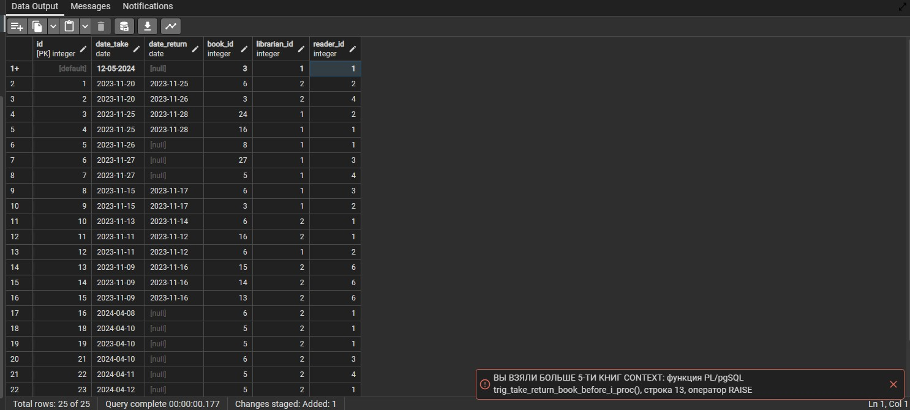

# Примеры запросов
```sql
CREATE TABLE AUTHOR (
    ID SERIAL PRIMARY KEY,
    SURNAME VARCHAR(100) NOT NULL,
    NAME VARCHAR(100) NOT NULL
);
```
```sql
CREATE INDEX SURNAME_NAME_IDX ON AUTHOR(SURNAME, NAME);
```

```sql
CREATE TABLE BOOK (
    ID SERIAL PRIMARY KEY,
    NAME VARCHAR(200) NOT NULL,
    CIPHER VARCHAR(30) NOT NULL,
    PUBLISH_YEAR INTEGER, CHECK(PUBLISH_YEAR > 1700)
);
```
```sql
CREATE INDEX NAME_IDX ON BOOK(NAME);
```

```sql
CREATE TABLE AUTHOR_BOOK (
	AUTHOR_ID INTEGER NOT NULL,
	BOOK_ID INTEGER NOT NULL,
	FOREIGN KEY (AUTHOR_ID) REFERENCES AUTHOR (ID) ON UPDATE CASCADE,
	FOREIGN KEY (BOOK_ID) REFERENCES BOOK (ID) ON DELETE CASCADE ON UPDATE CASCADE
);
```


```sql
CREATE TABLE READER (
	ID SERIAL PRIMARY KEY NOT NULL,
	NAME VARCHAR(100) NOT NULL,
	SURNAME VARCHAR(100) NOT NULL,
	ADDRESS VARCHAR(100)
);
```

```sql
CREATE INDEX READER_SURNAME_NAME_IDX ON READER(SURNAME, NAME);
```

```sql
CREATE TABLE NUM_PHONE_READER (
	TEL_NUMBER VARCHAR(20) PRIMARY KEY NOT NULL,
	READER_ID INTEGER NOT NULL,
	FOREIGN KEY (READER_ID) REFERENCES READER (ID) ON DELETE CASCADE ON UPDATE CASCADE
);
```


```sql
CREATE TABLE LIBRARIAN (
	ID SERIAL PRIMARY KEY NOT NULL,
	NAME VARCHAR(100) NOT NULL,
	SURNAME VARCHAR(100) NOT NULL,
	ADDRESS VARCHAR(100)
);
```
```sql
CREATE INDEX LIBRARIAN_SURNAME_NAME_IDX ON LIBRARIAN(SURNAME, NAME);
```

```sql
CREATE TABLE NUM_PHONE_LIBRARIAN (
	TEL_NUMBER VARCHAR(20) PRIMARY KEY NOT NULL,
	LIBRARIAN_ID INTEGER NOT NULL,
	FOREIGN KEY (LIBRARIAN_ID) REFERENCES LIBRARIAN (ID) ON DELETE CASCADE ON UPDATE CASCADE
);
```


```sql
CREATE TABLE TAKE_RETURN_BOOK (
    ID SERIAL PRIMARY KEY NOT NULL,
    DATE_TAKE DATE NOT NULL,
    DATE_RETURN DATE,
	BOOK_ID INTEGER NOT NULL,
	LIBRARIAN_ID INTEGER NOT NULL,
	READER_ID INTEGER NOT NULL,
	CHECK (DATE_TAKE > CAST('2010-01-01' AS DATE)),
	FOREIGN KEY (BOOK_ID) REFERENCES BOOK (ID) ON UPDATE CASCADE,
	FOREIGN KEY (LIBRARIAN_ID) REFERENCES LIBRARIAN (ID) ON UPDATE CASCADE,
	FOREIGN KEY (READER_ID) REFERENCES READER (ID) ON DELETE CASCADE ON UPDATE CASCADE
);
```
```sql
CREATE INDEX DATE_TAKE_IDX ON TAKE_RETURN_BOOK(DATE_TAKE);
```

```sql
INSERT INTO AUTHOR (surname, name) VALUES ('Пушкин', 'Александр');
INSERT INTO AUTHOR (surname, name) VALUES ('Лермонтов', 'Михаил');
INSERT INTO AUTHOR (surname, name) VALUES ('Достоевский', 'Фёдор');
INSERT INTO AUTHOR (surname, name) VALUES ('Горький', 'Максим');
```
```sql
--ВЫВОД КНИГ И АВТОРОВ
SELECT  B.NAME AS BOOK_NAME, A.NAME AS AUTHOR_NAME, A.SURNAME AS AUTHOR_SURNAME
FROM BOOK B, AUTHOR A, AUTHOR_BOOK AB
WHERE B.ID = AB.BOOK_ID AND AB.AUTHOR_ID = A.ID --AND A.SURNAME = 'Чехов'
ORDER BY AUTHOR_NAME DESC, BOOK_NAME DESC
```
```sql
--Найти автора у которого нет книги в БД
SELECT * 
FROM AUTHOR A
WHERE NOT EXISTS 
	(SELECT *
	FROM AUTHOR_BOOK AB
	WHERE A.ID = AB.AUTHOR_ID)
```

```sql
SELECT *
FROM BOOK
WHERE CAST(CIPHER AS INTEGER) BETWEEN 2000 AND 3999
```

```sql
SELECT PUBLISH_YEAR, PUBLISH_YEAR+4 AS PY
FROM BOOK
WHERE CAST(CIPHER AS INTEGER) BETWEEN 2000 AND 3999
```

```sql
SELECT *
FROM AUTHOR
WHERE NAME NOT LIKE '%р'
```

```sql
SELECT *
FROM AUTHOR
WHERE NAME LIKE '%#%а%' ESCAPE '#'
```
```sql
-- 2.1 Найти Минимальный год издания книги авторов у которых фамилия содержит буквосочетание "ев"
SELECT MIN (B.PUBLISH_YEAR) as GOD--, A.SURNAME AS SURNAME
FROM BOOK B, AUTHOR A, AUTHOR_BOOK AB
WHERE B.ID = AB.BOOK_ID AND AB.AUTHOR_ID = A.ID AND A.SURNAME LIKE '%ов' --%ев не существует
--GROUP BY A.SURNAME
```

```sql
-- 2.1.1 Найти Минимальный год издания книги авторов у которых фамилия содержит буквосочетание "ев" вывод года издания с фамилией автора
SELECT B.PUBLISH_YEAR as ГОД, A.SURNAME AS ФАМИЛИЯ
FROM BOOK B, AUTHOR A, AUTHOR_BOOK AB
WHERE B.ID = AB.BOOK_ID AND AB.AUTHOR_ID = A.ID AND A.SURNAME LIKE '%ов' AND B.PUBLISH_YEAR = 
	(SELECT MIN (B.PUBLISH_YEAR) as GOD--, A.SURNAME AS SURNAME
	FROM BOOK B, AUTHOR A, AUTHOR_BOOK AB
	WHERE B.ID = AB.BOOK_ID AND AB.AUTHOR_ID = A.ID AND A.SURNAME LIKE '%ов')
```
```sql
-- 2.2 Найти количество Читателей, которые брали книгу автора "Пушкин".
SELECT COUNT(TRB.BOOK_ID) AS Readers
FROM BOOK B, AUTHOR A, AUTHOR_BOOK AB, TAKE_RETURN_BOOK TRB
WHERE B.ID = AB.BOOK_ID AND AB.AUTHOR_ID = A.ID AND UPPER(A.SURNAME) = 'ПУШКИН' AND TRB.BOOK_ID = AB.BOOK_ID
```
```sql
-- 2.3 Найти Фамилии библиотекарей, которые выдавали книги с названиями которые содержат : 
--три любых символа в начале потом слово "стульев".  
--Так что-бы были найдены и "12 стульев" и "13 стульев" но не были найдены "5 стульев"
SELECT L.SURNAME AS BIBI
FROM BOOK B, LIBRARIAN L, TAKE_RETURN_BOOK TRB
WHERE B.ID = TRB.BOOK_ID AND B.NAME LIKE '___стульев' AND L.ID = TRB.LIBRARIAN_ID
```

```sql
--  2.4 Найти читателей(ФИО читателя, Дата взятия книги) которые брали книги после определенной даты, 
--отсортировать вывод вложенной сортировкой по дате(по убыванию) потом по фамилии читателя(по возрастанию). 
--Для сравнения с датой используется такая конструкция date_taken >= CAST('25-MAR-2024' as DATE). 
--Мы строку преобразуем к дате. Дата в строке должна быть именно в таком формате. 
--В современных СУБД можно использовать и такое сравнение date_taken >= TO_DATE('25-MAR-2024'). 
--Я на postgreSql не проверял, но должно работать и то и то, попробуй.
SELECT R.NAME, R.SURNAME, TRB.DATE_TAKE
FROM READER R, TAKE_RETURN_BOOK TRB
WHERE R.ID = TRB.READER_ID AND TRB.DATE_TAKE >= CAST('26-NOV-2023' AS DATE)
ORDER BY TRB.DATE_TAKE DESC, R.SURNAME ASC
```

```sql
--2.5 Найти Фамилии и телефоны читателей, которые еще не вернули книги (is NULL) отсортировать их по фамилии читателя.
SELECT R.SURNAME, NPR.TEL_NUMBER
FROM READER R, NUM_PHONE_READER NPR, TAKE_RETURN_BOOK TRB
WHERE R.ID = TRB.READER_ID AND TRB.DATE_RETURN IS NULL AND R.ID = NPR.READER_ID
ORDER BY R.SURNAME
```

```sql
--2.6 Найти книги которые брали читатели в определенный период времени по датам(даты взять самому с даты по дату). 
--Вывести всю информацию о книгах и дату выдачи книги. Отсортировать по дате выдачи книги. 
--Вместо года издания вывести количество дней назад, которое была выпущена книга относительно текущей даты. 
--Для этого использовать функцию NOW() которая получает текущую дату. 
SELECT B.NAME, B.PUBLISH_YEAR, TRB.DATE_TAKE, AGE(TRB.DATE_TAKE), NOW() - TRB.DATE_TAKE AS СЕГОДНЯ
FROM TAKE_RETURN_BOOK TRB, BOOK B
WHERE B.ID = TRB.BOOK_ID AND TRB.DATE_TAKE >= CAST('26-NOV-2023' AS DATE)  AND TRB.DATE_TAKE <= CAST('29-NOV-2023' AS DATE)
ORDER BY DATE_TAKE
```

```sql
--2.6.1 Найти книги которые брали читатели в определенный период времени по датам(даты взять самому с даты по дату). 
--Вывести всю информацию о книгах и дату выдачи книги. Отсортировать по дате выдачи книги. 
--Вместо года издания вывести количество дней назад, которое была выпущена книга относительно текущей даты. 
--Для этого использовать функцию NOW() которая получает текущую дату. C BETWEEN
SELECT B.NAME, B.PUBLISH_YEAR, TRB.DATE_TAKE, AGE(TRB.DATE_TAKE), NOW() - TRB.DATE_TAKE AS СЕГОДНЯ
FROM TAKE_RETURN_BOOK TRB, BOOK B
WHERE B.ID = TRB.BOOK_ID AND TRB.DATE_TAKE BETWEEN CAST('26-NOV-2023' AS DATE) AND CAST('29-NOV-2023' AS DATE) 
ORDER BY DATE_TAKE
```

```sql
--Вывести те книги которые брали 2 раза и более
SELECT B.NAME AS НАЗВАНИЕ, COUNT(TRB.BOOK_ID) AS КОЛИЧЕСТВО_ВЗЯТИЙ_КНИГИ
FROM BOOK B, TAKE_RETURN_BOOK TRB
WHERE B.ID = TRB.BOOK_ID
GROUP BY B.NAME
HAVING COUNT(TRB.BOOK_ID) >= 2
```

```sql
--Для каждого читателя посчитать сколько раз он брал каждую книгу.
SELECT R.ID, R.NAME AS ИМЯ, R.SURNAME AS ФАМИЛИЯ, B.NAME AS НАЗВАНИЕ, COUNT(TRB.BOOK_ID) AS КОЛИЧЕСТВО_ВЗЯТИЙ_КНИГИ
FROM BOOK B, TAKE_RETURN_BOOK TRB, READER R
WHERE B.ID = TRB.BOOK_ID AND R.ID = TRB.READER_ID 
GROUP BY R.ID, R.NAME, R.SURNAME, B.NAME
ORDER BY R.ID
--HAVING COUNT(TRB.BOOK_ID) >= 2
```

```sql
--НАЙТИ АВТОРОВ КНИГ КОТОРЫХ ЧИТАЮТ ЧИТЕЛИ ПРОЖИВАЮЩИЕ НА УЛИЦЕ ЖУКОВА
SELECT A.NAME, A.SURNAME, B.NAME
FROM AUTHOR A, AUTHOR_BOOK AB, BOOK B, TAKE_RETURN_BOOK TRB
WHERE A.ID = AB.AUTHOR_ID AND B.ID = AB.BOOK_ID AND TRB.BOOK_ID = B.ID AND TRB.READER_ID IN
	(SELECT R.ID
	FROM READER R
	WHERE R.ADDRESS LIKE '%Жукова%')
```
```sql
--ALTER TABLE READER ADD BIRTH_DATE DATE; //добавить столбец
--ALTER TABLE READER DROP BIRTH_DATE; //удалить столбец
```

```sql
--2.1  Найти фамилии читателей, которые брали книги год издания которых позже среднего года издания всех книг.
SELECT DISTINCT R.SURNAME 
FROM READER R, BOOK B, TAKE_RETURN_BOOK TRB
WHERE R.ID = TRB.READER_ID AND B.ID = TRB.BOOK_ID AND B.PUBLISH_YEAR > 
	(SELECT AVG(PUBLISH_YEAR)
	 FROM BOOK)
```

```sql
--2.2 Найти книги у которых год издания больше чем год рождения всех(ALL) читателей проживающих на улице Жукова.
SELECT DISTINCT B.NAME
FROM BOOK B, TAKE_RETURN_BOOK TRB
WHERE B.PUBLISH_YEAR > ALL
	(SELECT (EXTRACT(YEAR FROM BIRTH_DATE)) AS YEAR
	FROM READER
	WHERE ADDRESS LIKE '%Жуков%')
```

```sql
--2.3 Найти авторов у которых год издания книг равен году рождения любого(any) из читателей проживающих на улице Жукова.
SELECT DISTINCT A.NAME, A.SURNAME, B.NAME, B.PUBLISH_YEAR
FROM AUTHOR A, AUTHOR_BOOK AB, TAKE_RETURN_BOOK TRB, BOOK B, READER R
WHERE A.ID = AB.AUTHOR_ID AND B.ID = AB.BOOK_ID--СМОТР ПРОДОЛ. НИЖЕ
AND PUBLISH_YEAR = ANY 
	(SELECT EXTRACT (YEAR FROM BIRTH_DATE) AS YEAR
	 FROM READER
	 WHERE ADDRESS LIKE '%Жуков%')
```


```sql
--2.4 Добавить дату рождения библиотекарю.
ALTER TABLE LIBRARIAN ADD BIRTH_DATE DATE;
```

```sql
--2.5 При помощи in, ,group by, having найти всех Читателей которые за определенный период 
--(с даты по дату) взяли ровно три книги.
SELECT R.ID, R.NAME AS ИМЯ, R.SURNAME AS ФАМИЛИЯ, COUNT(TRB.BOOK_ID) AS СЧЕТЧИК
FROM READER R, TAKE_RETURN_BOOK TRB
WHERE R.ID = TRB.READER_ID AND TRB.BOOK_ID IN 
	(SELECT BOOK_ID 
	 FROM TAKE_RETURN_BOOK
	 WHERE TRB.DATE_TAKE BETWEEN CAST('13-NOV-2023' AS DATE) AND CAST('26-NOV-2023' AS DATE))
GROUP BY R.ID--, ИМЯ, ФАМИЛИЯ --ЕСЛИ ПО АЙДИШНИКУ, ТО ИМЯ И ФАМИЛИЯ НЕ НУЖНО ВПИСЫВАТЬ, 
HAVING COUNT (TRB.BOOK_ID) = 3
```
```sql
--Также для предварительного просмотра и проверки, что совпадает с результатом 2.5
SELECT * FROM public.take_return_book
WHERE DATE_TAKE BETWEEN CAST('13-NOV-2023' AS DATE) AND CAST('26-NOV-2023' AS DATE)
ORDER BY DATE_TAKE ASC 
```

```sql
SELECT R.*, TRB.*
FROM READER R LEFT JOIN TAKE_RETURN_BOOK TRB ON R.ID = TRB.READER_ID
```


```sql
-- 2.8 При помощи not exists. Найти фамилии имена даты рождения читателей у которых нет номеров телефонов.
--Будет использоваться запрос с корреляцией, когда поле в условии во вложенном запросе будет поле из внешнего запроса. 
--То есть оно будет ссылаться на таблицу(или псевдоним) и ее поле из внешнего запроса. В этом случае это будет READER.ID.
SELECT R.SURNAME, R.NAME, R.BIRTH_DATE
FROM READER R
WHERE NOT EXISTS 
	(SELECT *
	 FROM NUM_PHONE_READER NPR
	 WHERE R.ID = NPR.READER_ID)
```
```sql
--2.9 При помощи in написать запрос с корреляцией, который найдет библиотекарей, 
--которые выдавали книги с определенной даты по определенную дату более 2 раз.
SELECT * 
FROM LIBRARIAN L
WHERE L.ID IN 
	(SELECT L.ID
	FROM TAKE_RETURN_BOOK TRB
	WHERE DATE_TAKE BETWEEN CAST('25-NOV-2023' AS DATE) AND CAST('27-NOV-2023' AS DATE) AND L.ID = TRB.LIBRARIAN_ID
	GROUP BY L.ID
	HAVING COUNT(TRB.DATE_TAKE) >= 2)
```
```sql
--ПРИМЕР ОБЪЕДИНЕНИЯ С ПОМОЩЬЮ UNION
--Создать общую таблицу из читателей и библиотекарей.
(SELECT R.NAME, R.SURNAME, R.BIRTH_DATE
FROM READER R)
UNION
(SELECT L.NAME, L.SURNAME, L.BIRTH_DATE
FROM LIBRARIAN L)
```
```sql
--ПРИМЕР ПЕРЕСЕЧЕМНИЯ С ПОМОЩЬЮ INTERSECT
--СОЗДАТЬ ТАБЛИЦУ У КОТОРЫХ ЕСТЬ БИБЛИОТЕКАРИ В ЧИТАТЕЛЯХ
(SELECT R.NAME, R.SURNAME, R.BIRTH_DATE
FROM READER R)
INTERSECT
(SELECT L.NAME, L.SURNAME, L.BIRTH_DATE
FROM LIBRARIAN L)
```
```sql
--ПРИМЕР ИСКЛЮЧЕНИЕ С ПОМОЩЬЮ EXCEPT
--СОЗДАТЬ ТАБЛИЦУ ЧИТАТЕЛЕЙ, КОТОРЫЕ НЕ ЯВЛЯЮТСЯ БИБЛИОТЕКАРЯМИ
(SELECT R.NAME, R.SURNAME, R.BIRTH_DATE
FROM READER R)
EXCEPT
(SELECT L.NAME, L.SURNAME, L.BIRTH_DATE
FROM LIBRARIAN L)
```
```sql
--ПРИМЕР INSERT НА ОСНОВЕ SELECT
INSERT INTO READER (NAME, SURNAME, ADDRESS, BIRTH_DATE) 
SELECT NAME, SURNAME, ADDRESS, BIRTH_DATE 
FROM LIBRARIAN L
WHERE L.ID = 2
```
```sql
--2.1 При помощи inner join найти только тех библиотекарей, которые выдавали книги и даты выдачи книг.
SELECT L.NAME AS ИМЯ, L.SURNAME AS ФАМИЛИЯ, DATE_TAKE
FROM LIBRARIAN L
INNER JOIN TAKE_RETURN_BOOK ON L.ID = LIBRARIAN_ID
```
```sql
--2.2 При помощи left join найти вообще всех библиотекарей и если библиотекарь выдавал книгу 
--то напротив написать даты выдачи книг если ни разу не выдавал напротив будет null.
SELECT L.NAME, L.SURNAME, TRB.DATE_TAKE
FROM LIBRARIAN L LEFT JOIN TAKE_RETURN_BOOK TRB ON TRB.LIBRARIAN_ID = L.ID
```
```sql
-- 2.3 Найти то же самое как в предыдущем запросе но при помощи right join.
SELECT L.NAME, L.SURNAME, TRB.DATE_TAKE
FROM TAKE_RETURN_BOOK TRB RIGHT JOIN LIBRARIAN L ON TRB.LIBRARIAN_ID = L.ID
```
```sql
-- 2.4 Подумать и обосновать можно-ли придумать и применить запрос на основе full join к нашей базе данных.
SELECT L.NAME, L.SURNAME, TRB.DATE_TAKE
FROM TAKE_RETURN_BOOK TRB FULL JOIN LIBRARIAN L ON TRB.LIBRARIAN_ID = L.ID
```
```sql
-- 2.5 При помощи union объединить результаты двух запросов, которые сформируют общий список с фамилиями, 
--именами, телефонами всех читателей и всех библиотекарей. Фамилии и имена будут повторяться для каждого
--телефона, так и планируется в данной задаче.
(SELECT R.NAME, R.SURNAME, R.BIRTH_DATE, NPR.TEL_NUMBER
FROM READER R, NUM_PHONE_READER NPR
WHERE R.ID = NPR.READER_ID)
UNION
(SELECT L.NAME, L.SURNAME, L.BIRTH_DATE, NPL.TEL_NUMBER
FROM LIBRARIAN L, NUM_PHONE_LIBRARIAN NPL
WHERE L.ID = NPL.LIBRARIAN_ID)
```
```sql
--2.6 При помощи intersect найти Фамилии Имена библиотекарей, 
--которые являются еще и читателями, сравнение будет происходить по имени и по фамилии. 
--Для смысла запроса добавить в базу данных фамилии имена к читателям такие же как у некоторых библиотекарей, 
--что-бы некоторых библиотекарей сделать читателями.
(SELECT L.NAME, L.SURNAME
FROM LIBRARIAN L)
INTERSECT
(SELECT R.NAME, R.SURNAME
FROM READER R)
```
```sql
-- 2.7 При помощи except найти Фамилии Имена библиотекарей, которые не являются читателями. 
--Сравнение будет происходить по имени и по фамилии.
(SELECT L.NAME, L.SURNAME
FROM LIBRARIAN L)
EXCEPT
(SELECT R.NAME, R.SURNAME
FROM READER R)
```
```sql
-- 2.10 Написать запрос с корреляцией который для читателей, которые брали хотя-бы одну книгу выведет сколько раз
--читатель брал книги по каждому автору, при этом выберет только те случаи когда читатель брал автора более 1 раза. 
--Результатом запроса будет Фамилия Читателя, Имя Читателя, Фамилия Автора, Имя Автора, Количество взятий больших 1.
SELECT * 
FROM READER R
WHERE R.ID IN 
	(SELECT R.ID
	FROM TAKE_RETURN_BOOK TRB
	WHERE R.ID = TRB.READER_ID
	GROUP BY R.ID
	HAVING COUNT(TRB.DATE_TAKE) > 0)
```
```sql
-- 2.10 Написать запрос с корреляцией который для читателей, которые брали хотя-бы одну книгу выведет сколько раз
--читатель брал книги по каждому автору, при этом выберет только те случаи когда читатель брал автора более 1 раза. 
--Результатом запроса будет Фамилия Читателя, Имя Читателя, Фамилия Автора, Имя Автора, Количество взятий больших 1.
SELECT * 
FROM READER R
WHERE EXISTS
	(SELECT R.ID
	FROM TAKE_RETURN_BOOK TRB
	WHERE R.ID = TRB.READER_ID)
```
```sql
CONSTRAINT - ограничение целостоности
```
```sql
-- СОЗДАТЬ СПИСОК ВРЕДИТЕЛЕЙ, КОТОРЫЕ НЕ ВЕРНУЛИ КНИГУ ЧЕРЕЗ VIEW
CREATE VIEW READER_NULL_RETURN
AS SELECT R.NAME AS ИМЯ, R.SURNAME AS ФАМИЛИЯ, B.NAME КНИГА, TRB.DATE_TAKE AS ВЗЯТО
FROM TAKE_RETURN_BOOK TRB, BOOK B, READER R
WHERE TRB.DATE_RETURN IS NULL AND B.ID = TRB.BOOK_ID AND R.ID = TRB.READER_ID
```
```sql
--Написать представление которое находит читателей и их телефоны.
CREATE VIEW READER_PHONES
AS SELECT R.NAME AS ИМЯ, R.SURNAME AS ФАМИЛИЯ, NPR.TEL_NUMBER AS ТЕЛЕФОН
FROM READER R, NUM_PHONE_READER NPR
WHERE NPR.READER_ID = R.ID
```
```sql
--СОЗДАНИЕ СВОЕГО ДОМЕНА(ТИПА) ПОЛ
CREATE DOMAIN SEX_TYPE CHAR CHECK(VALUE IN ('М', 'Ж'));
```
```sql
--Пример объявления составного первичного ключа
CREATE TABLE READER (
   NAME VARCHAR(20),
   SURNAME VARCHAR(20),
   PRIMARY KEY(NAME, SURNAME) //Составной первичный ключ
);
```
```sql
--Пример ограничения целостности в виде наложения уникальности на одно поле
CREATE TABLE READER (
   ID SERIAL NOT NULL PRIMARY KEY, 
   NAME VARCHAR(20) UNIQUE, // Уникальность
   SURNAME VARCHAR(20) DEFAULT 'ПЕТРИЩЕВ'
);
```
```sql
--Пример ограничения целостности в виде наложения уникальности на несколько полей
CREATE TABLE READER (
   ID SERIAL NOT NULL PRIMARY KEY, 
   NAME VARCHAR(20),
   SURNAME VARCHAR(20),
   UNIQUE(NAME, SURNAME) //Составной уникальный ключ(наложение требования уникальности)
);
```
```sql
DEPARTMENT (
    ID   NUMBER,
    NAME VARCHAR2(128)
)

EMPLOYEE (
    ID            NUMBER,
    NAME          VARCHAR2(128),
    DEPARTMENT_ID NUMBER,
    MANAGER_ID    NUMBER, -- сотрудник
    SALARY        NUMBER
)
```
```sql
--Задание 2. Вывести сотрудников, получающих максимальную заработную плату в своем отделе
SELECT D.NAME, D.NAME, MAX(SALARY) AS MAX_SALARY
FROM DEPARTMENT D, EMPLOYEE E
WHERE D.ID = E.DEPARTMENT_ID
GROUP BY E.NAME

SELECT E.NAME
FROM EMPLOYEE E
WHERE SALARY = (SELECT MAX(SALARY) 
				FROM EMPLOYEE E1
				WHERE E.DEPARTMENT_ID = E1.DEPARTMENT_ID)

/*Лучший и быстрый запрос от чат гопопты*/
SELECT e.ID, e.NAME, e.DEPARTMENT_ID, e.SALARY
FROM EMPLOYEE e
INNER JOIN (
    SELECT DEPARTMENT_ID, MAX(SALARY) AS MAX_SALARY
    FROM EMPLOYEE
    GROUP BY DEPARTMENT_ID
) max_salaries ON e.DEPARTMENT_ID = max_salaries.DEPARTMENT_ID AND e.SALARY = max_salaries.MAX_SALARY;


--Задание 3. Вывести отделы, количество сотрудников в которых не превышает 3 человек
SELECT D.NAME, COUNT(E.NAME)
FROM DEPARTMENT D, EMPLOYEE E
WHERE D.ID = E.DEPARTMENT_ID
GROUP BY D.NAME
HAVING COUNT(E.ID) <= 3
```
# Траназакция
* ***Транзакция – это логическая единица работы, которая не должна разделяться на части.***
## Свойства *ACID*:
* Атомарность (Atomicity)
* Согласованность (Consistency)
* Изоляция (Isolation)
* Долговечность (Durability)

## ЯЗЫК PL/pgSQL (ПРОЦЕДУРНЫЙ ЯЗЫК)
```SQL
-- CREATE FUNCTION ADD_ONE (INT4) 
-- RETURNS INT4 AS '
-- BEGIN
-- RETURN $1 + 1; 
-- END;'
-- LANGUAGE 'plpgsql';

SELECT ADD_ONE(4);
```
```SQL 
DROP FUNCTION ADD_ONE
```
С несколькими переменными
```sql
CREATE FUNCTION GEOM_AVG(INTEGER, INTEGER) RETURNS FLOAT8 AS '
DECLARE
	FIRST ALIAS FOR $1;	
	SECOND ALIAS FOR $2;
BEGIN
	RETURN SQRT(FIRST * SECOND::FLOAT8);
END;
' LANGUAGE 'plpgsql';
```
```SQL
CREATE FUNCTION DFS() RETURNS TIMESTAMP AS '
DECLARE
	T TIMESTAMP;
BEGIN
	T = now;
	RETURN T;
END;
' LANGUAGE 'plpgsql';
```
```SQL
CREATE FUNCTION TREF() RETURNS BOOK.NAME%TYPE AS '
DECLARE
	N BOOK.NAME%TYPE;
BEGIN
	SELECT NAME
	FROM BOOK
	WHERE ID = 1
	INTO N;
	RETURN N;
END;'  LANGUAGE 'plpgsql';
```
```SQL
--2. Напишем хранимую процедуру, которая будет вызываться 1 раз в месяц. Она будет копировать все данные из TAKE_RETURN_BOOK в 
--_ARCHIVE_TAKE_RETURN_BOOK за последний месяц, при этом сверяя ID что-бы не получить два одинаковых ID. 
--После этого она будет удалять все записи из архива, дата которых превышает 1 год от текущей даты.
CREATE PROCEDURE ARCHIVE_TRB_PROC() AS '
DECLARE
	DATE_TAKE_MONTH_AGO TAKE_RETURN_BOOK.DATE_TAKE%TYPE;
BEGIN
	DATE_TAKE_MONTH_AGO =  date_trunc(''month'', CURRENT_DATE) - interval ''1 month'';
	RAISE NOTICE ''МЫ ВЫЧИТАЛИ %'', CAST(DATE_TAKE_MONTH_AGO AS VARCHAR);
END;
'
LANGUAGE 'plpgsql';
```
```SQL
-- ВЫЗОВ ПРОЦЕДУРЫ
CALL ARCHIVE_TRB_PROC();
```
```SQL
--2. Напишем хранимую процедуру, которая будет вызываться 1 раз в месяц. Она будет копировать все данные из TAKE_RETURN_BOOK в 
--_ARCHIVE_TAKE_RETURN_BOOK за последний месяц, при этом сверяя ID что-бы не получить два одинаковых ID. 
--После этого она будет удалять все записи из архива, дата которых превышает 1 год от текущей даты.
CREATE OR REPLACE PROCEDURE ARCHIVE_TRB_PROC() AS 
$$
DECLARE
	DATE_TAKE_MONTH_AGO TAKE_RETURN_BOOK.DATE_TAKE%TYPE;
	ROW TAKE_RETURN_BOOK%ROWTYPE;
BEGIN
	DATE_TAKE_MONTH_AGO =  date_trunc(''month'', CURRENT_DATE) - interval '1 month';
	RAISE NOTICE 'МЫ ВЫЧИТАЛИ %', CAST(DATE_TAKE_MONTH_AGO AS VARCHAR);
	FOR ROW IN SELECT *
	FROM TAKE_RETURN_BOOK TRB
	WHERE TRB.DATE_TAKE >= DATE_TAKE_MONTH_AGO 
	LOOP
		IF NOT EXISTS(SELECT *
					  FROM _ARCHIVE_TAKE_RETURN_BOOK ATRB
					  WHERE ID = ROW.ID)
		THEN
			INSERT INTO _ARCHIVE_TAKE_RETURN_BOOK(id, date_take, date_return, book_id, librarian_id, reader_id)
			VALUES(ROW.id, ROW.date_take, ROW.date_return, ROW.book_id, ROW.librarian_id, ROW.reader_id);
		END IF;
	END LOOP;
END;
$$
LANGUAGE 'plpgsql';
```
2. Создать триггер before на добавление записи в таблицу TAKE_RETURN_BOOK, который проверит, что количество данных книг в наличии не меньше 0, если меньше, то выбросить исключительную ситуацию, с соответствующим сообщением. Если все нормально, то отнимет одну книгу из находящихся в наличии.
```SQL
CREATE OR REPLACE PROCEDURE TRIG_TAKE_RETURN_BOOK_BEFORE_I_PROC() AS 
'
DECLARE
	A_COUNT INTEGER;
BEGIN
	SELECT AVAILABLE_COUNT INTO A_COUNT FROM BOOK WHERE(OLD.BOOK_ID);
	IF A_COUNT - 1 < 0
	THEN
		RAISE EXCEPTION ''НЕТ ДАННОЙ КНИГИ В НАЛИЧИИ ПЕРЕЗВОНИТЕ ПОЗЖЕ'';
	END IF;
	UPDATE BOOK
	SET AVAILABLE_COUNT = A_COUNT - 1
	WHERE ID = OLD.BOOK_ID;
END;
'LANGUAGE 'plpgsql';
```
### ДЗ ПО ХРАНИМЫМ ПРОЦЕДУРАМ
<font color="ff6c01"> 2. Написать хранимую, функцию, получающую день недели в виде аргумента и возвращающую название дня недели в виде строки(1 - Понедельник, 2 - Вторник и т.д.). Предполагается использование конструкции Case. Продемонстрировать ее работу.</font>
```SQL
CREATE FUNCTION GET_DAYS(INTEGER) RETURNS VARCHAR(100) AS 
'
DECLARE
	N ALIAS FOR $1;
	RES VARCHAR(100);
BEGIN
	RES := CASE
			WHEN N = 1
			THEN ''ПОНЕДЕЛЬНИК''
			WHEN N = 2
			THEN ''ВТОРНИК''
			WHEN N = 3
			THEN ''СРЕДА''
			WHEN N = 4
			THEN ''ЧЕТВЕРГ''
			WHEN N = 5
			THEN ''ПЯТНИЦА''
			WHEN N = 6
			THEN ''СУББОТА''
			WHEN N = 7
			THEN ''ВОСКРЕСЕНЬЕ''
		END;
	RAISE NOTICE ''%'', RES;
	RETURN RES;
END;
' LANGUAGE 'plpgsql';
```
```SQL
SELECT GET_DAYS(2) -- ВТОРНИК
```
<font color="ff6c01">3. Написать хранимую функцию, которая принимает в качестве параметра название улицы(без слова улица, площадь и т.д) и пол, посчитает количество библиотекарей и читателей, проживающих на этой улице с таким полом,
 и если таких людей больше 3 -
           то посчитает количество книг, которые брались любыми читателями проживающими на этой улице за все время,
           а если нет, подсчитает количество книг которое еще не вернули читатели проживающие на этой улице.
  (В этой задаче планируется использование оператора IF)</font>
  ```SQL
  CREATE OR REPLACE FUNCTION GET_READER_STREET(VARCHAR, READER.SEX%TYPE) RETURNS VARCHAR(255) AS 
$$
DECLARE
	S ALIAS FOR $1;
	SEXX ALIAS FOR $2;
	LC INTEGER;
    RC INTEGER;
    BC INTEGER;
BEGIN
	SELECT COUNT(*) INTO LC
	FROM READER R
	WHERE R.ADDRESS LIKE '%'||S||'%' AND R.SEX = SEXX;
	
	SELECT COUNT(*) INTO RC
	FROM LIBRARIAN L
	WHERE L.ADDRESS LIKE '%'||S||'%' AND L.SEX = SEXX;

	IF RC > 3 THEN
        SELECT COUNT(*)
        INTO BC
        FROM TAKE_RETURN_BOOK TRB
        WHERE TRB.READER_ID IN (
            SELECT R.ID
            FROM READER R
            WHERE R.ADDRESS LIKE '%'||S||'%' AND R.SEX = SEXX
			);
    ELSE
        SELECT COUNT(*)
        INTO BC
        FROM TAKE_RETURN_BOOK TRB
        WHERE TRB.READER_ID IN (
            SELECT ID
            FROM READER R
            WHERE R.ADDRESS LIKE '%'||S||'%' AND R.SEX = SEXX
        )
        AND TAKE_RETURN_BOOK.DATE_RETURN IS NULL;
    END IF;

    RETURN BC;
END;
$$ LANGUAGE 'plpgsql';
```
### VERSION 2.0.0
```SQL
CREATE OR REPLACE FUNCTION GET_READER_STREET(VARCHAR, READER.SEX%TYPE) RETURNS VARCHAR(255) AS 
$$
DECLARE
  S ALIAS FOR $1;
  SEXX ALIAS FOR $2;
  LC INTEGER;
  RC INTEGER;
  BC INTEGER;
BEGIN
  SELECT COUNT(*) INTO LC
  FROM READER R
  WHERE R.ADDRESS LIKE '%'||S||'%' AND R.SEX = SEXX;
  
  SELECT COUNT(*) INTO RC
  FROM LIBRARIAN L
  WHERE L.ADDRESS LIKE '%'||S||'%' AND L.SEX = SEXX;

  IF (RC + LC) > 3 THEN
      SELECT COUNT(*)
      INTO BC
      FROM TAKE_RETURN_BOOK TRB, READER R
      WHERE TRB.READER_ID = R.ID AND R.ADDRESS LIKE '%'||S||'%' AND R.SEX = SEXX;
  ELSE
      SELECT COUNT(*)
      INTO BC
      FROM TAKE_RETURN_BOOK TRB, READER R
      WHERE TRB.READER_ID = R.ID AND R.ADDRESS LIKE '%'||S||'%' AND R.SEX = SEXX AND TRB.DATE_RETURN IS NULL;
  END IF;

  RETURN BC;
END;
$$ LANGUAGE 'plpgsql';
```
<font color="ff6c01"> 4. Написать хранимую функцию, которая принимает в качестве аргумента дату и расчитывает средний рост библиотекарей которые родились до этой даты и средний рост библиотекарей, которые родились после этой даты.
В качестве результата возвращает строковое значение из двух величин, склеенных между собой через пробел. Если каких-то библиотекарей нет, на этом месте в строке должно быть слово нет.  </font>
```SQL
CREATE OR REPLACE FUNCTION AHBB(DATE) RETURNS VARCHAR(255) AS 
$$
DECLARE
	DATE_ARG ALIAS FOR $1;
    AVG_H_BEFORE INTEGER;
    AVG_H_AFTER INTEGER;
BEGIN
    
    SELECT AVG(HEIGHT)
    INTO AVG_H_BEFORE
    FROM READER R
    WHERE R.BIRTH_DATE < DATE_ARG;

    
    SELECT AVG(HEIGHT)
    INTO AVG_H_AFTER
    FROM READER R
    WHERE R.BIRTH_DATE >= DATE_ARG;

    
    RETURN COALESCE(AVG_H_BEFORE::VARCHAR(255), 'нет') || ' ' || COALESCE(AVG_H_AFTER::VARCHAR(255), 'нет');
END;
$$ LANGUAGE plpgsql;
```
<font color="ff6c01">Написать функцию которая переберет месяца с 1 по 8, через один(то есть 1, 3, 5, 7) и для каждого месяща посчитает сколько в нем брали книг. (Предполагается использование цикла while либо цикла for). Результат вернет в виде строки в которой значения записаны через пробел.</font>
```SQL
CREATE OR REPLACE FUNCTION CBPM() RETURNS VARCHAR(255) AS 
$$
DECLARE
    MN INTEGER := 1;
    RT VARCHAR(255) := '';
BEGIN
    FOR MN IN 1..7 BY 2 LOOP
        DECLARE
            BC INTEGER;
        BEGIN
            -- Подсчет количества книг, взятых в текущем месяце
            SELECT COUNT(*)
            INTO BC
            FROM TAKE_RETURN_BOOK
            WHERE EXTRACT(MONTH FROM DATE_TAKE) = MN;

            -- Добавление результата к строке с результатами
            RT := RT || ' ' || MN::VARCHAR(255) || ':'|| COALESCE(BC::VARCHAR(255), '0');
        END;
    END LOOP;

    RETURN TRIM(RT);
END;
$$ LANGUAGE plpgsql;
```
### Триггеры продолжение
2. Создать триггер на удаление записи из TAKE_RETURN_BOOK, который будет для соответствующей книги увеличивать ее Количество в наличии на единицу.
```SQL
-- Создание функции для триггера
CREATE FUNCTION TRIG_DELETE_RECORD_PROC() RETURNS TRIGGER AS
$$
DECLARE

BEGIN
	UPDATE BOOK SET available_count = available_count + 1
	WHERE ID = OLD.BOOK_ID;
	RETURN OLD;
END;
$$
LANGUAGE 'plpgsql';
-- Создание триггера для удаления записи после
CREATE TRIGGER TRIG_DELETE_RECORD AFTER DELETE ON TAKE_RETURN_BOOK FOR EACH ROW EXECUTE FUNCTION TRIG_DELETE_RECORD_PROC();
```
```SQL
-- 3. Создать триггер на обновление (UPDATE) таблицы TAKE_RETURN_BOOK.
-- При этом если изменилась книга, которую взяли, необходимо количество в наличии добавить старой книге, 
-- а для новой книги наоборот отнять для нее количество в таблице BOOK. Если книг для новой книги недостаточно, 
-- нужно отменить операцию изменения путем генерации исключения и возврата NULL.
CREATE FUNCTION TRIG_UPDATE_RECORD_PROC() RETURNS TRIGGER AS
$$
DECLARE
	NEW_B_A_COUNT INTEGER;
BEGIN
	IF OLD.BOOK_ID <> NEW.BOOK_ID
	THEN
		SELECT AVAILABLE_COUNT INTO NEW_B_A_COUNT
		FROM BOOK B
		WHERE B.ID = NEW.BOOK_ID;
		IF NEW_B_A_COUNT = 0
		THEN
			RAISE EXCEPTION 'НЕДОСТАТОЧНО КНИГ В НАЛИЧИИ';
			RETURN NULL;
		END IF;
		
		UPDATE BOOK
		SET available_count = available_count + 1
		WHERE ID = OLD.BOOK_ID;
		
		UPDATE BOOK
		SET available_count = available_count - 1
		WHERE ID = NEW.BOOK_ID;
	END IF;
	RETURN NEW;
END;
$$
LANGUAGE 'plpgsql';
CREATE TRIGGER TRIG_UPDATE_RECORD BEFORE UPDATE ON TAKE_RETURN_BOOK FOR EACH ROW EXECUTE FUNCTION TRIG_UPDATE_RECORD_PROC();
```
### ДОМАШЕНЕЕ ЗАДАНИЕ ПО ТРИГГЕРАМ
<font color="ff6c01">1. Добавить бизнес логику, что-бы невозможно было выдать одному человеку более 5 книг на руки. Для этого исправить триггеры INSERT и UPDATE для таблицы TAKE_RETURN_BOOK. </font>
```SQL
-- СЧИТЫВАЕМ К-ВО НЕ ВЕРНУТЫХ КНИГ
	SELECT COUNT(*) INTO CHECK_NUM
	FROM TAKE_RETURN_BOOK TRB
	WHERE NEW.READER_ID = TRB.READER_ID AND TRB.DATE_RETURN IS NULL;
	IF CHECK_NUM > 5
	THEN
		RAISE EXCEPTION 'ВЫ ВЗЯЛИ БОЛЬШЕ 5-ТИ КНИГ';
		RETURN NULL;
	END IF;
```
<font color="ff6c01"> С UPADATE ТОЖЕ САМОЕ, ЧТО С INSERT</font>
```SQL
-- FUNCTION: public.trig_take_return_book_before_i_proc()

-- DROP FUNCTION IF EXISTS public.trig_take_return_book_before_i_proc();

CREATE OR REPLACE FUNCTION public.trig_take_return_book_before_i_proc()
    RETURNS trigger
    LANGUAGE 'plpgsql'
    COST 100
    VOLATILE NOT LEAKPROOF
AS $BODY$
DECLARE
	A_COUNT INTEGER;
	MSG VARCHAR(255);
	CHECK_NUM INTEGER;
BEGIN
	-- СЧИТЫВАЕМ К-ВО НЕ ВЕРНУТЫХ КНИГ
	SELECT COUNT(*) INTO CHECK_NUM
	FROM TAKE_RETURN_BOOK TRB
	WHERE NEW.READER_ID = TRB.READER_ID AND TRB.DATE_RETURN IS NULL;
	IF CHECK_NUM > 5
	THEN
		RAISE EXCEPTION 'ВЫ ВЗЯЛИ БОЛЬШЕ 5-ТИ КНИГ';
		RETURN NULL;
	END IF;
	SELECT AVAILABLE_COUNT FROM BOOK WHERE(NEW.BOOK_ID = ID) INTO A_COUNT;
	IF A_COUNT - 1 < 0
	THEN
		RAISE EXCEPTION 'НЕТ ДАННОЙ КНИГИ В НАЛИЧИИ ПЕРЕЗВОНИТЕ ПОЗЖЕ';
		RETURN NULL;
	END IF;
	UPDATE BOOK
	SET AVAILABLE_COUNT = AVAILABLE_COUNT - 1
	WHERE ID = NEW.BOOK_ID;
	RETURN NEW;
END;
$BODY$;

ALTER FUNCTION public.trig_take_return_book_before_i_proc()
    OWNER TO postgres;
```

2. 
```SQL
CREATE DOMAIN OPERATION_TYPE VARCHAR(6) CHECK(VALUE IN ('INSERT', 'UPDATE', 'DELETE'));
CREATE TABLE LOG_READER(
	ID SERIAL PRIMARY KEY,
	DATE_TIME TIMESTAMP,
	USER_NAME VARSCHAR(30),
	OPERATION OPERATION_TYPE,
	CHAGGED_FIELDS VARCHAR(1000)
);
```
```SQL
CREATE OR REPLACE FUNCTION LOG_READER_INSERT() RETURNS TRIGGER AS 
$$
BEGIN
	INSERT INTO LOG_READER (USER_NAME, OPERATION, CHAGGED_FIELDS)
	VALUES (CURRENT_USER, INSERT, (
		SELECT STRING_AGG(COLUMN_NAME || ':' || NEW[COLUMN_NAME], ';' ORDER BY COLUMN_NAME)
		FROM INFORMATION_SCHEMA.COLUMNS
		WHERE TABLE_NAME = 'READER' AND COLUMN_NAME <> 'ID'
	));
	RETURN NEW;
END;
$$ LANGUAGE plpgsql;

CREATE TRIGGER TRIG_READER_INSERT_TRIGGER AFTER INSERT ON READER FOR EACH ROW EXECUTE FUNCTION LOG_READER_INSERT();
```
```SQL
CREATE OR REPLACE FUNCTION log_reader_insert()
RETURNS TRIGGER AS $$
BEGIN
    INSERT INTO LOG_READER (DATE_TIME, USER_NAME, operation, chagged_fields)
    VALUES (NOW(), current_user, 'INSERT', 'address:'|| NEW.address || '; ' || 'birth_date:' || NEW.birth_date ||'; ' || 'height: ' || NEW.height || '; ' || 'login: ' || new.login || '; ' || 'name: ' || NEW.name || '; ' || 'surname: ' || NEW.surname|| ';');
    RETURN NEW;
END;
$$ LANGUAGE plpgsql;
```
```SQL
CREATE OR REPLACE FUNCTION log_reader_delete()
RETURNS TRIGGER AS $$
BEGIN
    INSERT INTO LOG_READER (DATE_TIME, USER_NAME, operation, chagged_fields)
    VALUES (NOW(), current_user, 'DELETE', 'address:'|| OLD.address || '; ' || 'birth_date:' || OLD.birth_date ||'; ' || 'height: ' || OLD.height || '; ' || 'login: ' || OLD.login || '; ' || 'name: ' || OLD.name || '; ' || 'surname: ' || OLD.surname|| ';');
    RETURN OLD;
END;
$$ LANGUAGE plpgsql;

CREATE TRIGGER trig_log_reader_delete
AFTER DELETE ON READER
FOR EACH ROW
EXECUTE FUNCTION log_reader_delete();
```
```SQL
CREATE OR REPLACE FUNCTION log_reader_update()
RETURNS TRIGGER AS $$
DECLARE
	RESULT_STR VARCHAR(300);
BEGIN
	RESULT_STR = '';
	IF OLD.NAME <> NEW.NAME
	THEN
		RESULT_STR = RESULT_STR  || 'NAME: ' || OLD.NAME || ' -> ' || NEW.NAME || ' ';
	END IF;
	IF OLD.SURNAME <> NEW.SURNAME
	THEN
		RESULT_STR = RESULT_STR  || 'SURNAME: ' || OLD.SURNAME || ' -> ' || NEW.SURNAME || ' ';
	END IF;
	IF OLD.LOGIN <> NEW.LOGIN
	THEN
		RESULT_STR = RESULT_STR  || 'LOGIN: ' || OLD.LOGIN || ' -> ' || NEW.LOGIN || ' ';
	END IF;
    INSERT INTO LOG_READER (DATE_TIME, USER_NAME, operation, chagged_fields)
    VALUES (NOW(), current_user, 'UPDATE', RESULT_STR);
    RETURN NEW;
END;
$$ LANGUAGE plpgsql;

CREATE TRIGGER trig_log_reader_update
AFTER UPDATE ON READER
FOR EACH ROW
EXECUTE FUNCTION log_reader_update();
```
```SQL
CREATE OR REPLACE PROCEDURE CLEAN_LOG_TABLE_READER(DATE) AS 
$$
DECLARE
	D ALIAS FOR $1;
BEGIN
	DELETE FROM LOG_READER
	WHERE DATE_TIME::date < D - INTERVAL '1 year';
END;
$$ LANGUAGE 'plpgsql';

call CLEAN_LOG_TABLE_READER('13-05-2026'::DATE)
```
## ВАРИАНТ ОТ ЧАТ ГОПОТЫ
```SQL
-- Создание таблицы для лога изменений
CREATE TABLE LOG_READER (
    id SERIAL PRIMARY KEY,
    date_time TIMESTAMP DEFAULT CURRENT_TIMESTAMP,
    "user" VARCHAR(255),
    operation_type VARCHAR(10),
    changed_fields TEXT
);

-- Создание триггера для операции INSERT
CREATE OR REPLACE FUNCTION log_reader_insert()
RETURNS TRIGGER AS $$
BEGIN
    INSERT INTO LOG_READER ("user", operation_type, changed_fields)
    VALUES (current_user, 'INSERT', (
        SELECT STRING_AGG(column_name || ':' || NEW[column_name], ';' ORDER BY column_name)
        FROM information_schema.columns
        WHERE table_name = 'READER'
        AND column_name <> 'id'
    ));
    RETURN NEW;
END;
$$ LANGUAGE plpgsql;

CREATE TRIGGER log_reader_insert_trigger
AFTER INSERT ON READER
FOR EACH ROW
EXECUTE FUNCTION log_reader_insert();

-- Создание триггера для операции UPDATE
CREATE OR REPLACE FUNCTION log_reader_update()
RETURNS TRIGGER AS $$
BEGIN
    INSERT INTO LOG_READER ("user", operation_type, changed_fields)
    VALUES (current_user, 'UPDATE', (
        SELECT STRING_AGG(column_name || ':' || OLD[column_name] || ':' || NEW[column_name], ';' ORDER BY column_name)
        FROM (
            SELECT column_name
            FROM information_schema.columns
            WHERE table_name = 'READER'
            AND column_name <> 'id'
        ) AS columns
        WHERE OLD.* IS DISTINCT FROM NEW.* OR OLD.id IS NULL OR NEW.id IS NULL
    ));
    RETURN NEW;
END;
$$ LANGUAGE plpgsql;

CREATE TRIGGER log_reader_update_trigger
AFTER UPDATE ON READER
FOR EACH ROW
EXECUTE FUNCTION log_reader_update();

-- Создание триггера для операции DELETE
CREATE OR REPLACE FUNCTION log_reader_delete()
RETURNS TRIGGER AS $$
BEGIN
    INSERT INTO LOG_READER ("user", operation_type, changed_fields)
    VALUES (current_user, 'DELETE', (
        SELECT STRING_AGG(column_name || ':' || OLD[column_name], ';' ORDER BY column_name)
        FROM information_schema.columns
        WHERE table_name = 'READER'
        AND column_name <> 'id'
    ));
    RETURN OLD;
END;
$$ LANGUAGE plpgsql;

CREATE TRIGGER log_reader_delete_trigger
AFTER DELETE ON READER
FOR EACH ROW
EXECUTE FUNCTION log_reader_delete();
```
## ПРИМЕР ДИНАМИЧЕСКОГО ЗАПРОСА
```SQL
CREATE OR REPLACE FUNCTION DYNAMIC_QUERY(VARCHAR(100)) RETURNS INTEGER AS 
$$
DECLARE
	Q_STR VARCHAR(100);
	RES integer;
BEGIN
	Q_STR = 'SELECT COUNT(*) FROM ' || $1;
	EXECUTE Q_STR INTO RES;
	RETURN RES;
END;
$$ LANGUAGE 'plpgsql';

SELECT DYNAMIC_QUERY('READER');
```
```sql
-- Найти аэропорты, из которых летали пассажиры, у которых имя фамилия содержит комбинацию 'MIRO', сидели при этом сидели на четных местах.
-- Пусть результирующие записи содержат    информацию об аэропорте, время вылета, фамилию имя пассажира.
EXPLAIN ANALYZE SELECT A.AIRPORT_NAME, T.PASSENGER_NAME
FROM BOOKINGS.AIRPORTS A, BOOKINGS.FLIGHTS F, BOOKINGS.TICKET_FLIGHTS TF, BOOKINGS.TICKETS T, BOOKINGS.BOARDING_PASSES BP
WHERE T.PASSENGER_NAME LIKE '%MIRO%' AND 
T.TICKET_NO = TF.TICKET_NO AND TF.FLIGHT_ID = F.FLIGHT_ID AND F.DEPARTURE_AIRPORT = A.AIRPORT_CODE AND BP.TICKET_NO = TF.TICKET_NO AND BP.FLIGHT_ID = TF.FLIGHT_ID
AND (SUBSTRING(BP.SEAT_NO, 1, LENGTH(BP.SEAT_NO) - 1)::INTEGER % 2 = 0);
```
## В ТАКИХ СЛУЧАЯХ В ОРАКЛ И МУСКУЛ ЕСТЬ КОНСТРУКЦИЯ PIVOT
```SQL
-- Запрос сколько книг брали за каждый из летнего месяца.
-- Ответ показать в виде месяцев расположенных в заголовке ответа.
-- А под ними - значения
SELECT
	SUM(CASE WHEN (EXTRACT (MONTH FROM DATE_TAKE)) = 3 THEN 1 ELSE 0 END) AS MARCH,
	SUM(CASE WHEN (EXTRACT (MONTH FROM DATE_TAKE)) = 4 THEN 1 ELSE 0 END) AS APRILE,
	SUM(CASE WHEN (EXTRACT (MONTH FROM DATE_TAKE)) = 5 THEN 1 ELSE 0 END) AS MAY
FROM TAKE_RETURN_BOOK
```
## ПРИМЕР ПЕРЕКРЁТСНОГО ЗАПРОСА
```SQL
-- Написать перекрестный запрос, который выведет в виде pivot таблицы отчет: 
-- сколько книг брали за каждый из весенних месяцев по годам.
-- Годы пусть располагаются в строках слева, месяцы в заголовках сверху. На пересечении пусть будет количество.
SELECT TT.YEAR, SUM(DECEMBER) AS DECEMBER, SUM(JANURAY) AS JANURAY, SUM(FEBRURAY) AS FEBRURAY, SUM(MARCH) AS MARCH, SUM(APRILE) AS APRILE, SUM(MAY) AS MAY, SUM(JUNE) AS JUNE, SUM(JULE) AS JULE, SUM(AUGUST) AS AUGUST, SUM(SEPTEMBER) AS SEPTEMBER, SUM(OCTOBER) AS OCTOBER, SUM(NOVEMBER) AS NOVEMBER
FROM (SELECT (EXTRACT (YEAR FROM TRB.DATE_TAKE)) as year,(EXTRACT (MONTH FROM DATE_TAKE)) as month,
	CASE WHEN (EXTRACT (MONTH FROM TRB.DATE_TAKE)) = 12 THEN COUNT(DATE_TAKE) ELSE 0 END AS DECEMBER,
	CASE WHEN (EXTRACT (MONTH FROM TRB.DATE_TAKE)) = 1 THEN COUNT(DATE_TAKE)  ELSE 0 END AS JANURAY,
	CASE WHEN (EXTRACT (MONTH FROM TRB.DATE_TAKE)) = 2 THEN COUNT(DATE_TAKE)  ELSE 0 END AS FEBRURAY,
	CASE WHEN (EXTRACT (MONTH FROM TRB.DATE_TAKE)) = 3 THEN COUNT(DATE_TAKE)  ELSE 0 END AS MARCH,
	CASE WHEN (EXTRACT (MONTH FROM TRB.DATE_TAKE)) = 4 THEN COUNT(DATE_TAKE)  ELSE 0 END AS APRILE,
	CASE WHEN (EXTRACT (MONTH FROM TRB.DATE_TAKE)) = 5 THEN COUNT(DATE_TAKE)  ELSE 0 END AS MAY,
	CASE WHEN (EXTRACT (MONTH FROM TRB.DATE_TAKE)) = 6 THEN COUNT(DATE_TAKE)  ELSE 0 END AS JUNE,
	CASE WHEN (EXTRACT (MONTH FROM TRB.DATE_TAKE)) = 7 THEN COUNT(DATE_TAKE)  ELSE 0 END AS JULE,
	CASE WHEN (EXTRACT (MONTH FROM TRB.DATE_TAKE)) = 8 THEN COUNT(DATE_TAKE)  ELSE 0 END AS AUGUST,
	CASE WHEN (EXTRACT (MONTH FROM TRB.DATE_TAKE)) = 9 THEN COUNT(DATE_TAKE)  ELSE 0 END AS SEPTEMBER,
	CASE WHEN (EXTRACT (MONTH FROM TRB.DATE_TAKE)) = 10 THEN COUNT(DATE_TAKE) ELSE 0 END AS OCTOBER,
	CASE WHEN (EXTRACT (MONTH FROM TRB.DATE_TAKE)) = 11 THEN COUNT(DATE_TAKE)  ELSE 0 END AS NOVEMBER
FROM TAKE_RETURN_BOOK TRB
GROUP BY (EXTRACT (YEAR FROM DATE_TAKE)),(EXTRACT (MONTH FROM DATE_TAKE))) TT
GROUP BY TT.YEAR;
```
```sql
-- Написать запрос, который при помощи аналитических функций посчитает соотношение 
-- полетов в каждом месяце по отношению ко всему году. Найти для 2016 года.
SELECT (EXTRACT (MONTH FROM F.ACTUAL_DEPARTURE)), COUNT(*) AS CNT, ROUND(COUNT(*)/(SUM(COUNT(*)) OVER()), 2)
FROM BOOKINGS.FLIGHTS F
WHERE (EXTRACT (YEAR FROM F.ACTUAL_DEPARTURE)) = 2016
GROUP BY (EXTRACT (MONTH FROM F.ACTUAL_DEPARTURE))
```
```SQL
-- 1. Написать перекрестный запрос (pivot), который по годам в заголовках строк и по кварталам в заголовках столбцов, на 
--  пересечении строк и столбцов посчитает сколько книг брали в кварталах каждого года.
-- (при необходимости использовать вложенный запрос внутри чекции FROM)
SELECT TT.YEAR, SUM(first_QUARTER) AS first_QUARTER, SUM(second_QUARTER) AS second_QUARTER, SUM(third_QUARTER) AS third_QUARTER, SUM(fourth_QUARTER) AS fourth_QUARTER 
FROM (SELECT (EXTRACT (YEAR FROM DATE_TAKE)) as year,(EXTRACT (QUARTER FROM DATE_TAKE)) as QUARTER,
	CASE WHEN (EXTRACT(QUARTER FROM DATE_TAKE)) = 1 THEN COUNT(DATE_TAKE) ELSE 0 END AS first_QUARTER,
	CASE WHEN (EXTRACT(QUARTER FROM DATE_TAKE)) = 2 THEN COUNT(DATE_TAKE) ELSE 0 END AS second_QUARTER,
	CASE WHEN (EXTRACT(QUARTER FROM DATE_TAKE)) = 3 THEN COUNT(DATE_TAKE) ELSE 0 END AS third_QUARTER,
	CASE WHEN (EXTRACT(QUARTER FROM DATE_TAKE)) = 4 THEN COUNT(DATE_TAKE) ELSE 0 END AS fourth_QUARTER
FROM TAKE_RETURN_BOOK
GROUP BY (EXTRACT (YEAR FROM DATE_TAKE)),(EXTRACT (QUARTER FROM DATE_TAKE))) TT
GROUP BY TT.YEAR
ORDER BY TT.YEAR;
```
```SQL
-- 1. Написать запрос, который посчитает за какой-то опредеденный год (год выбрать самостоятельно) поквартально(За основу взять теорию со стр 312):
--   а. Максимальное количество книг(max_book_taken_count_per_month_in_quarter), которое было взято в один месяц в квартале.
--   б. Максимальное количество книг  которое было за один месяц в течении всего года.
-- 	Результирующая таблица:
--                QUARTER(КВАРТАЛ), MONTH_NUMBER, MAX_BOOK_TAKEN_COUNT_PER_MONTH_IN_QUARTER, MAX_BOOK_TAKEN_COUNT_PER_MONTH_IN_YEAR
SELECT (EXTRACT(QUARTER FROM DATE_TAKE)) AS QUARTER, 
	   (EXTRACT(MONTH FROM DATE_TAKE)) AS MONTH, 
	   COUNT(DATE_TAKE),
	   MAX(COUNT(TRB.DATE_TAKE)) OVER () AS OVER_DATE_TAKE,
	   MAX(COUNT(TRB.DATE_TAKE)) OVER (PARTITION BY (EXTRACT(QUARTER FROM DATE_TAKE))) AS max_book_taken_count_per_month_in_quarter
FROM TAKE_RETURN_BOOK TRB
WHERE (EXTRACT(YEAR FROM DATE_TAKE)) = 2023
GROUP BY (EXTRACT(QUARTER FROM DATE_TAKE)), (EXTRACT(MONTH FROM DATE_TAKE))
```
```SQL
-- 2.  Написать запрос, который составит рейтинг взятия книг по месяцам за какой-то опредеденный год (год выбрать самостоятельно),
--     при этом для месяцев будут выведены кварталы(За основу взять теорию со стр 313):
-- 	Результирующая таблица:
--                  QUARTER(КВАРТАЛ), MONTH_NUMBER, BOOK_TAKEN_COUNT_PER_MONTH, TAKES_RANK
SELECT (EXTRACT(QUARTER FROM DATE_TAKE)) AS QUARTER, 
	   (EXTRACT(MONTH FROM DATE_TAKE)) AS MONTH_NUMBER, 
	   COUNT(DATE_TAKE) AS  BOOK_TAKEN_COUNT_PER_MONTH,
	   RANK() OVER (ORDER BY COUNT(DATE_TAKE) DESC) AS TAKES_RANK
	   
FROM TAKE_RETURN_BOOK TRB
WHERE (EXTRACT(YEAR FROM DATE_TAKE)) = 2023
GROUP BY (EXTRACT(QUARTER FROM DATE_TAKE)), (EXTRACT(MONTH FROM DATE_TAKE))
```
```sql
-- 3.  Написать запрос, который составит рейтинг количества взятия книг по месяцам внутри каждого квартала за какой-то опредеденный год (год выбрать самостоятельно),
--     (За основу взять теорию со стр 314):
-- 	Результирующая таблица:
--                 QUARTER(КВАРТАЛ), MONTH_NUMBER, BOOK_TAKEN_COUNT_PER_MONTH, TAKES_RANK_IN_QUARTER
SELECT (EXTRACT(QUARTER FROM DATE_TAKE)) AS QUARTER, 
	   (EXTRACT(MONTH FROM DATE_TAKE)) AS MONTH_NUMBER, 
	   COUNT(DATE_TAKE) AS  BOOK_TAKEN_COUNT_PER_MONTH,
	   RANK() OVER (PARTITION BY (EXTRACT(QUARTER FROM DATE_TAKE)) ORDER BY COUNT(DATE_TAKE) DESC) AS TAKES_RANK_IN_QUARTER
FROM TAKE_RETURN_BOOK TRB
WHERE (EXTRACT(YEAR FROM DATE_TAKE)) = 2023
GROUP BY (EXTRACT(QUARTER FROM DATE_TAKE)), (EXTRACT(MONTH FROM DATE_TAKE))
```
```sql
-- 4. Написать запрос, который составит рейтинг читателей(больше всего бравших книги и при этом вернувших их), за все время существования библиотеки
--    при помощи трех видов ранжирования(row_number(), rank(), dense_rank()). Проследить, что-бы в исходных данных встречались читатели с одинаковым количеством взятий книг,
--    что-бы продемонстрировать разницу в способах ранжирования.
--     (За основу взять теорию со стр 317)
--     Результирующая таблица:
--                NAME, SURNAME, TAKES_NUM, ROW_NUMBER_RNK, RNK, DENSE_RNK
SELECT R.NAME, R.SURNAME, COUNT(*), 
		ROW_NUMBER() OVER (ORDER BY COUNT(*) DESC) AS ROW_NUMBER_RNK,
		RANK() OVER (ORDER BY COUNT(*) DESC) AS RNK,
		DENSE_RANK() OVER (ORDER BY COUNT(*) DESC) AS DENSE_RANK_RNK
FROM TAKE_RETURN_BOOK TRB JOIN READER R ON R.ID = TRB.READER_ID
GROUP BY R.NAME, R.SURNAME
```
```SQL
-- 6. Написать запрос, который составит рейтинг читателей(больше всего бравших книги и при этом вернувших их), за все время существования библиотеки
--    при помощи rank() по кварталам(то есть за все время кто в 1-м квартале лучший, кто во 2-м квартале лучший и 
--    т.д, получается не внутри года, а за все первые кварталы, за все вторые кварталы и т.д.,
--    может не совсем логично, но так хочет заказчик :) ).
--     (За основу взять теорию со стр 318-320)
--    	       Результирующая таблица:
--                QUARTER(КВАРТАЛ), NAME, SURNAME, TAKES_NUM, RANK
SELECT EXTRACT(QUARTER FROM trb.DATE_TAKE), R.NAME as rn, R.SURNAME as rs, COUNT(*) as cnt, 
		RANK() OVER (PARTITION BY EXTRACT(QUARTER FROM TRB.DATE_TAKE) ORDER BY COUNT(*) DESC) AS RNK
FROM TAKE_RETURN_BOOK TRB JOIN READER R ON R.ID = TRB.READER_ID 
where TRB.DATE_RETURN IS NOT NULL AND TRB.DATE_TAKE IS NOT NULL
GROUP BY EXTRACT(QUARTER FROM trb.DATE_TAKE), R.NAME, R.SURNAME
```
```SQL 
-- 7. Взять оперделенный год, что-бы были для него данные. Для этого года посчитать для каждого месяца года соотношение количества 
--    взятых книг к общему количеству взятых книг за весь год.
--     (За основу взять теорию со стр 321-323)
--    	       Результирующая таблица:
--                YEAR, MONTH, TAKES_COUNT, PERCENT_OF_TOTAL
SELECT (EXTRACT(MONTH FROM DATE_TAKE)) AS MONTH, COUNT(TRB.DATE_TAKE),
				ROUND(COUNT(TRB.DATE_TAKE) / SUM(COUNT(TRB.DATE_TAKE)) OVER () * 100, 2)				
FROM TAKE_RETURN_BOOK TRB
WHERE (EXTRACT(YEAR FROM DATE_TAKE)) = 2023
GROUP BY (EXTRACT(MONTH FROM TRB.DATE_TAKE));
```
```sql
-- 8. Переделать предыдущий запрос, что бы для каждого месяца определить, является ли ежемесячный
--    итог максимальным, минимальным или находящимся где-то посредине:.
--     (За основу взять теорию со стр 323-324)
--    	       Результирующая таблица:
--                YEAR, MONTH, TAKES_COUNT, DESCRIPTOR
SELECT (EXTRACT(MONTH FROM DATE_TAKE)) AS MONTH, COUNT(TRB.DATE_TAKE),
				CASE COUNT(TRB.DATE_TAKE)
					WHEN MAX(COUNT(TRB.DATE_TAKE)) over () THEN 'H'
					WHEN MIN(COUNT(TRB.DATE_TAKE)) over () THEN 'L'
					else 'M'
				end as Descriptor
FROM TAKE_RETURN_BOOK TRB
WHERE (EXTRACT(YEAR FROM DATE_TAKE)) = 2023
GROUP BY (EXTRACT(MONTH FROM TRB.DATE_TAKE));
```
```SQL
-- 9. Рамки окон. Рамка от начала и до текущей записи. (За основу взять теорию со стр 323-326).
--    Написать запрос, который сделает накопительный расчет для каждого года сколько брали книг по годам
--    (получается нарастающее суммарное количество rolling_count).
--    Результирующая таблица:
--                YEAR, TAKES_COUNT, ROLLING_COUNT
SELECT (EXTRACT(YEAR FROM DATE_TAKE)) AS YEAR, COUNT(DATE_TAKE) AS TAKES_COUNT, SUM(COUNT(DATE_TAKE)) OVER (ORDER BY (EXTRACT(YEAR FROM DATE_TAKE))rows unbounded preceding) AS rolling_count
FROM TAKE_RETURN_BOOK
GROUP BY (EXTRACT(YEAR FROM DATE_TAKE))
```
```sql
-- 10. Рамки окон. Скользящее окно. Взять оперделенный год, что-бы были для него данные. Для этого года посчитать 
-- 	для каждой недели года среднее арифметическое из его значения взятых в ней книг
--     и двух ближайших предыдущей и следующей. (по сути по 3 недели).
--     (За основу взять теорию со стр 321-323)
--    	       Результирующая таблица:
--                YEAR, WEEK_NUMBER, TAKES_COUNT, ROLLING_3_WEEK_AVG
SELECT (EXTRACT(YEAR FROM DATE_TAKE)) AS YEAR, COUNT(DATE_TAKE) AS TAKES_COUNT, AVG(COUNT(DATE_TAKE)) OVER (ORDER BY (EXTRACT(YEAR FROM DATE_TAKE))rows between 1 preceding and 1 following) AS rolling_count
FROM TAKE_RETURN_BOOK
GROUP BY (EXTRACT(YEAR FROM DATE_TAKE))
```
```sql
-- 11. Рамки окон. Скользящее окно. Взять оперделенный год, что-бы были для него данные. 
-- 	Для этого года посчитать для каждого дня года среднее арифметическое из его значения взятых в нем книг
--     и трех ближайших перед и после. (по сути по 6 дней). Так, что-бы если нет данных на день ранее либо на день позднее, 
-- 	что-бы корректно велся расчет по отсутствию данных,
--     что-бы месяыа, находящиеся от текущего далее чем 3 дня, не учитывались.
--     (За основу взять теорию со стр 326)
--    	       Результирующая таблица:
--                DATE, TAKES_COUNT, ROLLING_3_DAY_AVG
SELECT trb.DATE_TAKE, COUNT(DATE_TAKE), AVG(COUNT(DATE_TAKE)) OVER (ORDER BY DATE_TAKE RANGE between INTERVAL '3 DAY' PRECEDING AND INTERVAL '3 DAY' FOLLOWING) AS ROLLING_3_DAY_AVG
FROM TAKE_RETURN_BOOK trb
GROUP BY DATE_TAKE
order by date_take;
```
```sql
-- 13. Взять оперделенный год, что-бы были для него данные. Посчитать по месяцам количество 
--     взятых книг и при помощи конкатенации строк для групп записей,
--     вывести имена читателей, которые брали книги в каждом из месяцев, для которых произведен расчет. 
SELECT (EXTRACT(MONTH FROM DATE_TAKE)), STRING_AGG(r.name,', ' order by  r.name ) as readdd
from reader r inner join take_return_book trb on r.id = trb.reader_id
where (EXTRACT(year FROM DATE_TAKE)) = 2023
group by (EXTRACT(MONTH FROM DATE_TAKE))
```
